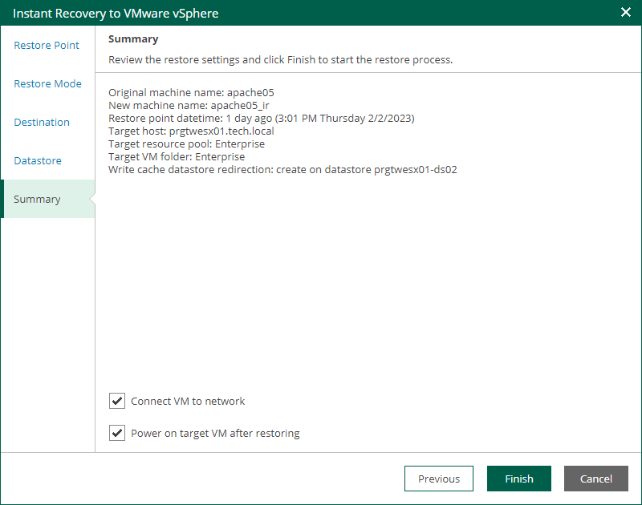

In this article

At the Summary step of the wizard, specify additional settings for Instant Recovery:

1. If you recover a VM that have failed and want to recover them with initial network settings, select the Connect VM to network check box.

If you recover a VM for testing disaster recovery while the original VM is still running, leave this check box unselected. Before you power on the recovered VM, you must disconnect it from the production network and connect to a non-production network to avoid conflicts.

1. To start the VM right after recovery, select the Power on target VM after restoring check box. If you recover the workloads to the production network, make sure that the original VM is powered off.
2. Review the settings that you have specified for Instant Recovery and click Finish.

To view the Instant Recovery progress, on the Machines tab, click History.

What You Do Next

After you have performed instant file share recovery, you have to finalize it. For more information, see [Finalizing Instant Recovery to VMware vSphere](instant_recovery_vsphere_finalize.md).

Page updated 9/4/2025

Page content applies to build 13.0.1.1071
