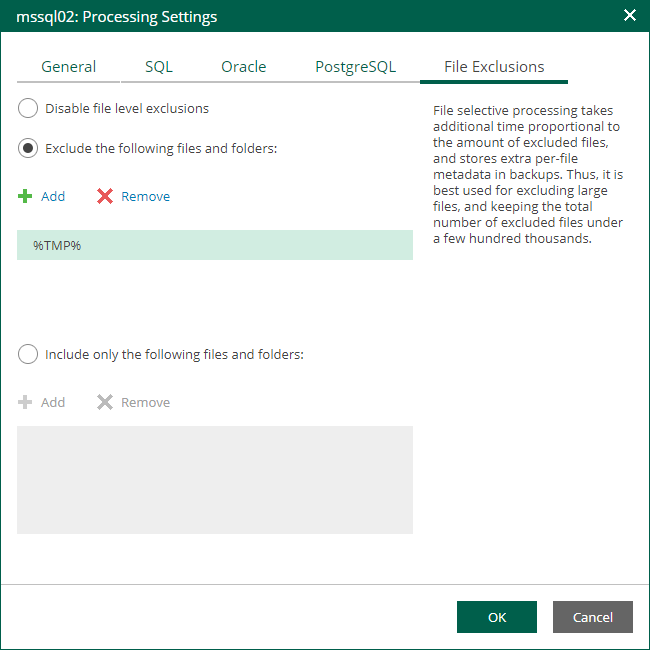

# VM Guest OS File Exclusion

If you do not want to back up specific files and folders on the VM guest OS, you can exclude them from the backup. Exclusions can help decrease the backup file size. However, selective processing takes additional time that depends on the number of excluded files. It also requires obtaining per-file metadata (stored in backups). Thus, it is recommended to use this option for excluding large files. By default, exclusions are disabled.

1. At the Guest Processing step of the wizard, make sure the Enable application-aware processing check box is selected.
2. Click the Customize Application link.
3. In the displayed window, select a VM from the list and click Edit.
4. On the File Exclusions tab, specify the files that must be excluded from the backup.

* Select Exclude the following files and folders to remove individual files and folders from the backup.
* Select Include only the following files and folders to leave only the specified files and folders in the backup.

1. Click Add and specify what files and folders you want to include or exclude.

To form the list of exclusions or inclusions, you can use full paths to files and folders, environmental variables, and file masks with the asterisk (\*) and question mark (?) characters. For more information, see the [VM Guest OS Files](https://helpcenter.veeam.com/docs/vbr/userguide/guest_file_exclusion.html?ver=13) section of the Veeam Backup & Replication User Guide.

