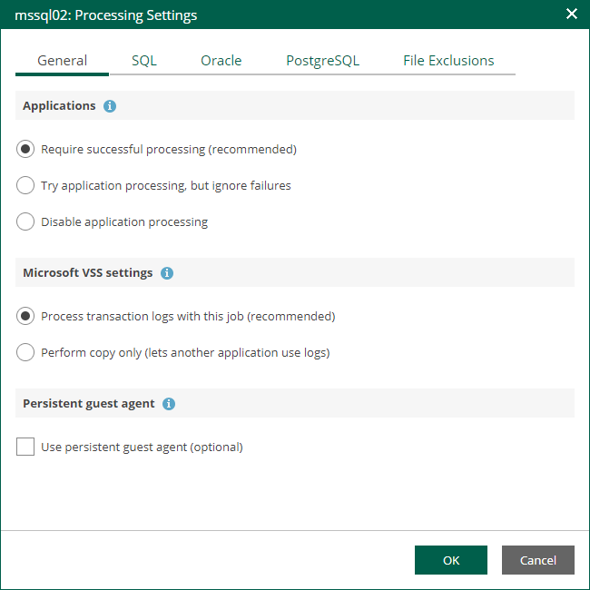
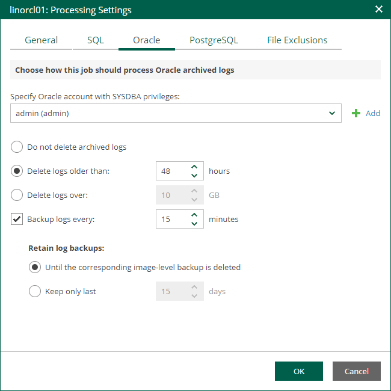

In this article

If you back up a VM where Oracle Database is deployed, you can specify how Veeam Backup & Replication must process archived redo logs on this VM.

1. At the Guest Processing step of the wizard, make sure the Enable application-aware processing check box is selected.
2. Click the Customize Application link.
3. In the displayed window, select the Oracle VM from the list and click Edit.
4. On the General tab of the VM Processing Settings window, make sure that either the Require successful processing or Try application processing, but ignore failures option is selected.

|  |
| --- |
| Important |
| If both Microsoft SQL Server and Oracle are installed on one machine, and this machine is processed by a job with log backup enabled for both applications, Veeam Backup & Replication will back up only Oracle transaction logs. Microsoft SQL Server transaction logs will not be processed. |

1. On the Oracle tab of the VM Processing Settings window, specify log processing settings.

1. Specify a user account that will connect to the Oracle database and perform Oracle archived logs backup and deletion.

* Select Use guest credentials to use the account specified at the Guest Processing step of the wizard to access the VM guest OS and connect to the Oracle database.
* Specify another account. To do this, select the necessary account from the drop-down list or click Add and add a new account.

Make sure the specified account has sufficient rights. For details, see the [Permissions](https://helpcenter.veeam.com/docs/vbr/userguide/veo_permissions.html?ver=13) section of the Veeam Explorers User Guide.

1. Specify how Veeam Backup & Replication must process archived redo logs on the Oracle VM.

* Select Do not delete archived logs to preserve archived redo logs on the original Oracle server.

Select this option for databases in the NOARCHIVELOG mode. If the database is in the ARCHIVELOG mode, archived logs on the VM guest OS may grow large and consume all disk space. In this case, database administrators must take care of archived logs themselves.

* Select Delete logs older than <N> hours / Delete logs over <N> GB to delete archived logs that are older than <N> hours or larger than <N> GB. The log size threshold refers not to the total size of all logs for all databases, but to the log size of each database on the selected Oracle VM.

When the parent backup job (job creating an image-level backup) runs, Veeam Backup & Replication will wait for the backup to complete successfully, and then trigger archived logs deletion on the Oracle VM over Oracle Call Interface (OCI). If the primary job does not manage to back up the Oracle VM, the logs will remain untouched on the VM guest OS until the next start of the non-persistent runtime components or persistent components.

|  |
| --- |
| Tip |
| Veeam Backup & Replication removes redo logs only after the parent backup job session. To remove redo logs more often, you can schedule the job to run more often. |

1. To back up Oracle archived logs with Veeam Backup & Replication, select the Backup logs every <N> minutes check box and specify the frequency for archived log backup. By default, archived logs are backed up every 15 minutes. The maximum log backup interval is 480 minutes.

|  |
| --- |
| Important |
| If you plan to use this option together with archived logs deletion from Oracle machine guest, make sure that these settings are consistent: logs should be deleted after they are backed up to repository. Thus, you need to set up backup schedule and log removal conditions appropriately. |

1. If you have selected the Backup logs every <N> minutes option, specify retention policy for the archived logs stored in the backup repository. For the Retain log backups setting, select one of the following:

* Select Until the corresponding image-level backup is deleted to apply the same retention policy for image-level backups and archived log backups.
* Select Keep only last <N> days to keep archived logs for a specific number of days. By default, archived logs are kept for 15 days. If you select this option, you must make sure that retention for archived logs is not greater than retention for the image-level backups. For more information, see the [Retention for Archived Log Backups](https://helpcenter.veeam.com/docs/vbr/userguide/oracle_backup_retention.html?ver=13) section of the Veeam Backup & Replication User Guide.

|  |
| --- |
| Note |
| Using the Veeam Backup & Replication console, you can also specify log shipping servers that you want to use to transport archived logs. For more information, see the [Oracle Archived Log Settings](https://helpcenter.veeam.com/docs/vbr/userguide/backup_job_vss_oracle_vm.html?ver=13) section of the Veeam Backup & Replication User Guide. |

Page updated 1/25/2024

Page content applies to build 13.0.1.1071
