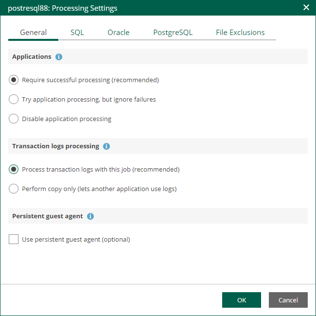

# PostgreSQL Archive Log Settings

If you back up a VM where PostgreSQL is deployed, you can specify how Veeam Backup & Replication must process PostgreSQL archive logs on this VM.

1. At the Guest Processing step of the wizard, make sure the Enable application-aware processing check box is selected.
2. Click the Customize Application link.
3. In the displayed window, select the PostgreSQL VM from the list and click Edit.
4. On the General tab of the VM Processing Settings window, make sure that either the Require successful processing or Try application processing, but ignore failures option is selected.

1. On the PostgreSQL tab of the VM Processing Settings window, specify settings for PostgreSQL logs processing.

1. Specify an account that will connect to the PostgreSQL instance and perform PostgreSQL archive logs backup and deletion. The pg\_hba.conf configuration file of the PostgreSQL instance must contain a record with the account.

* Select Use guest credentials to use the account specified at the Guest Processing step of the wizard to access the VM guest OS and connect to the PostgreSQL instance.
* Specify another account. To do this, select the necessary account from the drop-down list or click Add and add a new account.

Make sure the specified account has sufficient rights. For details, see the [Permissions](https://helpcenter.veeam.com/docs/vbr/userguide/vep_permissions.html?ver=13) section of the Veeam Explorers User Guide.

1. Specify an authentication method for the selected user account.

* Select Database user with password if you have specified an account with password-based authentication. In this case, you must provide Veeam Backup & Replication with the account password that will be stored in the Veeam Backup & Replication database.
* Select Database user with password file (.pgpass) if you have specified an account with password-based authentication. In this case, you do not have to specify the account password when adding the account in Veeam Backup & Replication. Instead, the account password must be specified in the PGPASS password file stored in the user's home directory.
* Select System user without password (peer) if you have specified a local system account with peer authentication.

1. To back up PostgreSQL archive logs with Veeam Backup & Replication, select the Backup logs every <N> minutes check box and specify the frequency for archive log backup. By default, archive logs are backed up every 15 minutes. The maximum log backup interval is 480 minutes.
2. If you have selected the Backup logs every <N> minutes option, specify retention policy for the archive logs stored in the backup repository. For the Retain log backups setting, select one of the following:

* Select Until the corresponding image-level backup is deleted to apply the same retention policy for image-level backups and archived log backups.
* Select Keep only last <N> days to keep archive logs for a specific number of days. By default, archive logs are kept for 15 days. If you select this option, you must make sure that retention for archive logs is not greater than retention for the image-level backups. For more information, see the [Retention for PostgreSQL WAL Files](https://helpcenter.veeam.com/docs/vbr/userguide/postrgresql_backup_retention.html?ver=13) section of the Veeam Backup & Replication User Guide.

1. In the PostgreSQL archive logs local temporary storage field, specify a path on the PostgreSQL machine that Veeam Backup & Replication will use to temporarily store PostgreSQL archive logs until they are backed up. Veeam Backup & Replication does not create the temporary storage folder so the folder must exist on the machine. Make sure the temporary location has enough free space for storing the log files.

|  |
| --- |
| Note |
| Using the Veeam Backup & Replication console, you can also specify log shipping servers that you want to use to transport archive logs. For more information, see the [Retention for PostgreSQL WAL Files](https://helpcenter.veeam.com/docs/vbr/userguide/postrgresql_backup_retention.html?ver=13) section of the Veeam Backup & Replication User Guide. |

