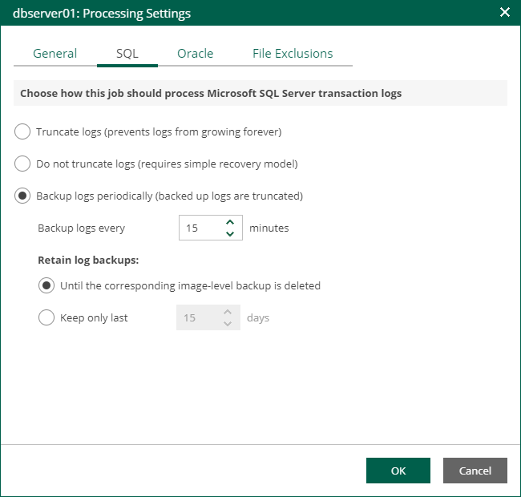

In this article

If you back up a Microsoft SQL VM, you can specify how Veeam Backup & Replication must process transaction logs on this VM.

1. At the Guest Processing step of the wizard, make sure the Enable application-aware processing check box is selected.
2. Click the Customize Application link.
3. In the displayed window, select the Microsoft SQL Server VM from the list and click Edit.
4. On the General tab of the VM Processing Settings window, make sure the following options are selected:

* In the Applications section, either the Require successful processing or Try application processing, but ignore failures option must be selected.
* In the Microsoft VSS settings section, the Process transaction logs with this job option must be selected.

1. Open the SQL tab of the VM Processing Settings window.
2. Specify how Veeam Backup & Replication will process SQL transaction logs.

* Select Truncate logs to truncate transaction logs after successful backup. The non-persistent runtime components or persistent components running on the VM guest OS will wait for the backup to complete successfully and then truncate transaction logs. If the job does not manage to back up the Microsoft SQL Server VM, the logs will remain untouched on the VM guest OS until the next start of the non-persistent runtime components or persistent components.

|  |
| --- |
| Note |
| If the account specified at the [Guest Processing](jobs_edit_guest_settings.md) step does not have enough rights, Veeam Backup & Replication tries to truncate logs using the NT AUTHORITY\SYSTEM account. Make sure that the account has permissions listed in the [Permissions](https://helpcenter.veeam.com/docs/vbr/userguide/vesql_permissions.html?ver=13) section of the Veeam Explorers User Guide. |

* Select Do not truncate logs to preserve transaction logs. When the backup job completes, Veeam Backup & Replication will not truncate transaction logs on the Microsoft SQL Server VM.

Select this option for databases that use the Simple recovery model. If you enable this option for databases that use the Full or Bulk-logged recovery model, transaction logs on the VM guest OS may grow large and consume all disk space. In this case, the database administrators must take care of transaction logs themselves.

* Select Backup logs periodically to back up transaction logs with Veeam Backup & Replication. Veeam Backup & Replication will periodically copy transaction logs to the backup repository and store them together with the image-level backup of the Microsoft SQL Server VM. During the backup job session, transaction logs on the VM guest OS will be truncated.

For more information, see the [Microsoft SQL Server Transaction Log Settings](https://helpcenter.veeam.com/docs/vbr/userguide/backup_job_vss_sql_vm.html?ver=13) sections of the Veeam Backup & Replication User Guide.

1. If you have selected the Backup logs periodically option, specify settings for transaction log backup:

1. In the Backup logs every <N> minutes field, specify the frequency for transaction log backup. By default, transaction logs are backed up every 15 minutes. The maximum log backup interval is 480 minutes.
2. In the Retain log backups section, specify retention policy for transaction logs stored in the backup repository.

* Select Until the corresponding image-level backup is deleted to apply the same retention policy for image-level backups and transaction log backups.
* Select Keep only last <N> days to keep transaction logs for a specific number of days. By default, transaction logs are kept for 15 days. If you select this option, you must make sure that retention for transaction logs is not greater than retention for the image-level backups. For more information, see [Retention for Transaction Log Backups](https://helpcenter.veeam.com/docs/vbr/userguide/sql_backup_retention.html) section of the Veeam Backup & Replication User Guide.

|  |
| --- |
| Note |
| Using the Veeam Backup & Replication console, you can also specify log shipping servers that you want to use to transport transaction logs. For more information, see the [Microsoft SQL Server Transaction Log Settings](https://helpcenter.veeam.com/docs/vbr/userguide/backup_job_vss_sql_vm.html?ver=13) section of the Veeam Backup & Replication User Guide. |

Page updated 1/25/2024

Page content applies to build 13.0.1.1071
