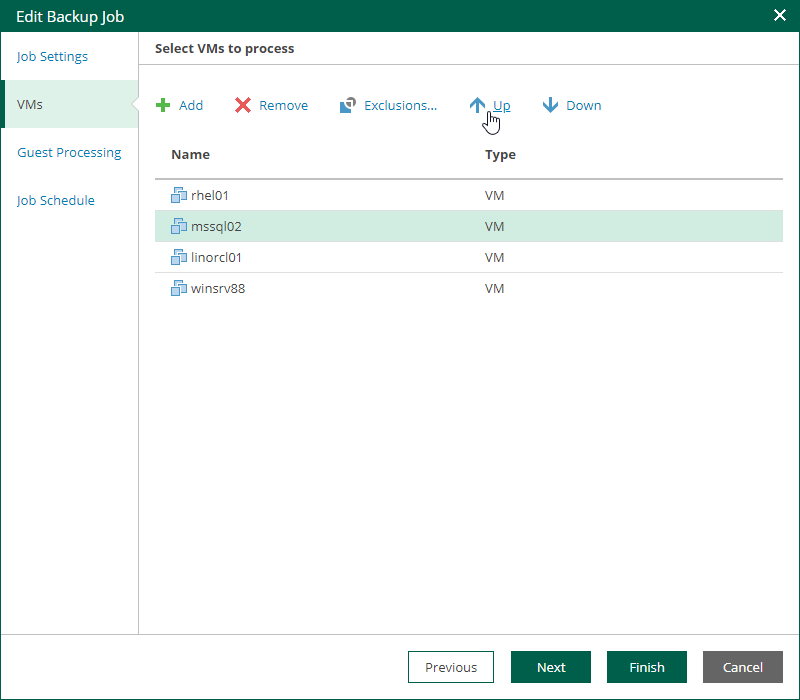

In this article

At the Virtual Machines step of the wizard, you can change the VM processing order. It can be helpful if specific VMs must be processed first, if you want to ensure that processing of a MV does not overlap with other scheduled activities, or that VM processing is completed before the certain time.

To change the VM processing order, select the necessary machines and move them up or down the list using the Up and Down buttons on the right. In the same manner, you can set the backup order for containers in the backup list.

|  |
| --- |
| Note |
| * VMs inside a VM container are processed at random. To ensure that VMs are processed in the defined order, add them as standalone VMs, not as a part of containers. * The processing order may differ from the order that you have defined. For example, if resources of a VM that is higher in the priority are not available, and resources of a VM that is lower in the priority are available, the VM with the lower priority will be processed first.  * For VMware Cloud Director backup jobs, you can change the order of the following Cloud Director objects: VMs, vApps, organization VDCs, organizations and the Cloud Director instance. The scope depends on your Cloud Director access rights. * For VMware Cloud Director replication jobs, you cannot change the VM processing order. You can manage only vApps and other Cloud Director containers. |

Page updated 9/4/2025

Page content applies to build 13.0.1.1071
