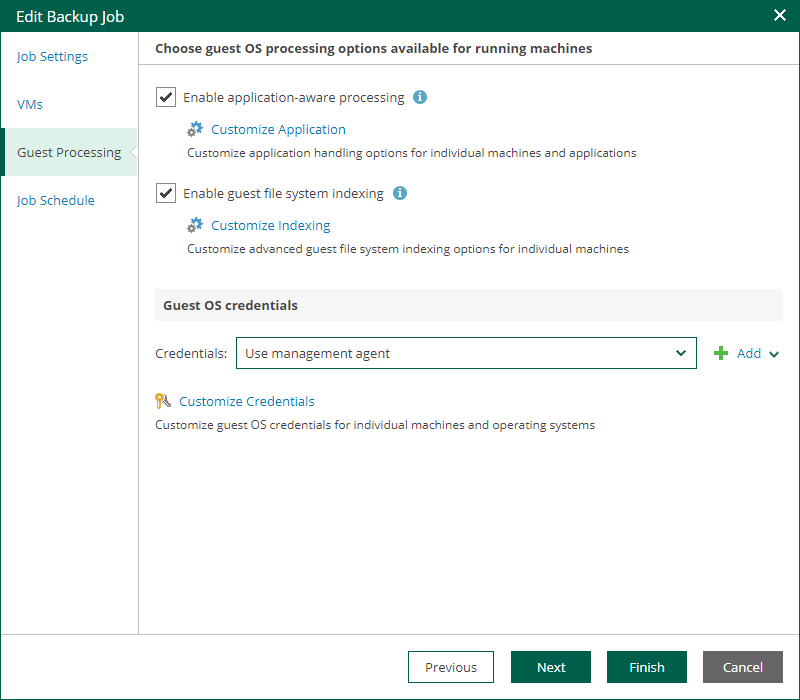

# Step 5. Configure Guest Processing Settings

At the Guest Processing step of the wizard, you can configure the following settings for VM guest OS processing:

* [Application-Aware Processing](em_edit_job_aaip_settings.md)
* [Guest OS File Indexing](em_indexing_options.md)
* [Guest OS Credentials](em_guest_os_credentials.md)

