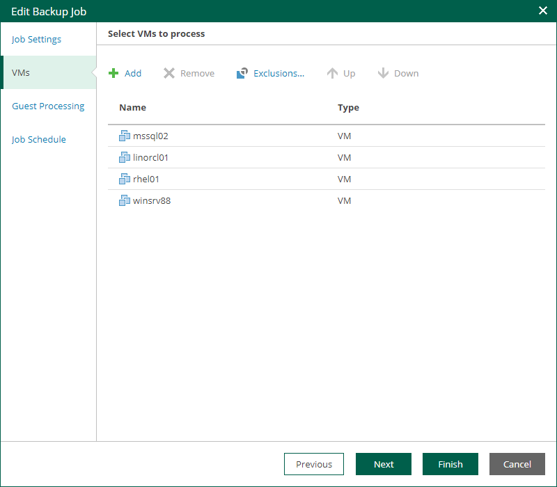

In this article

At the Virtual Machines step of the wizard, you can add or remove individual VMs or VM containers, for example, entire hosts or clusters. Jobs with VM containers are dynamic in their nature: if a new machine is added to the container after the job is created, the job is automatically updated to include the added machine.

|  |
| --- |
| Note |
| * For VMware Cloud Director backup jobs, you can add and remove the following Cloud Director objects: VMs, vApps, organization VDCs, organizations and the Cloud Director instance. The scope depends on your Cloud Director access rights. * For VMware Cloud Director replication jobs, you cannot add or remove single VMs. You can manage only vApps and other Cloud Director containers. |

Adding VMs and VM containers

To add a VM or a VM container:

1. Click the Add.

1. In the virtual infrastructure tree, select the necessary VMs or VM containers.

If you select a VM container and later add a new VM to the container, Veeam Backup & Replication will update job settings automatically to include the VM.

|  |
| --- |
| Tip |
| To quickly find the necessary objects, you can do the following:   * Search for objects: type a name or part of a name in the search field. Specify the type of the object from a scroll list next to the search field.  * Use the buttons in the upper-right corner to switch between virtual infrastructure views:  * For Microsoft Hyper-V objects, you can switch between the Hosts and VMs, Hosts and Volumes, and Hosts and VM Groups views. * For VMware vSphere objects, you can switch between the Hosts and Clusters, VMs and Templates, Datastores and VMs and Tags and VMs views. * For VMware Cloud Director, protection groups, unstructured data and Nutanix AHV, switching the views is not available. |

1. Click OK to save the changes.

Removing VMs and VM containers

To remove a VM or VM container, select it in the list and click Remove.

Excluding VMs

You can also exclude individual VMs from VM containers (for example, if you need to back up the whole VMware or Hyper-V server except several machines running on this server).

To exclude VMs from a VM container:

1. Select a VM container in the list and click Exclusions.
2. In the Exclusions window, click Add and select machines that you want to exclude.

Page updated 10/30/2025

Page content applies to build 13.0.1.1071
