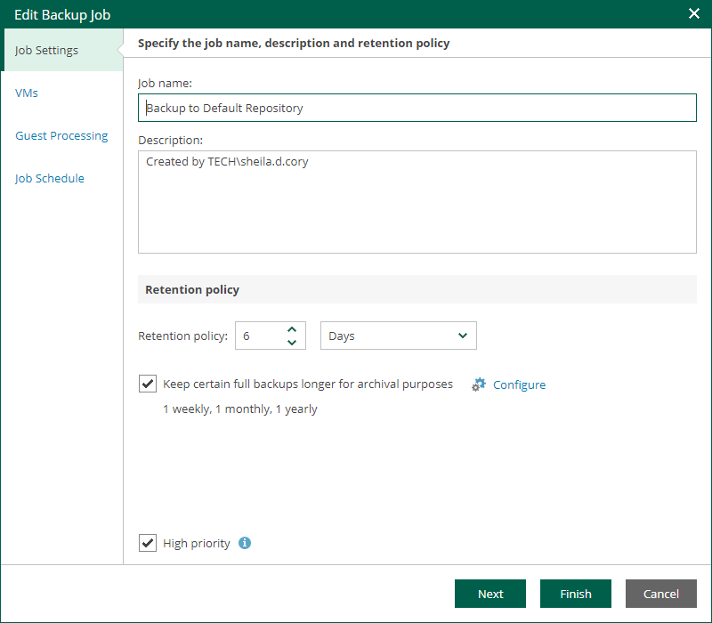

# Step 2. Edit Job Name and Retention Settings

At the Job Settings step of the wizard, you can modify name and description for the selected job, as well as its retention policy.

1. In the Job name field, enter a name for the job.
2. In the Description field, provide an optional description for future reference. The default description contains information about the user who created the job, date and time when the job was created.
3. To change retention policy settings, in the Retention policy section, specify the number of days that you want to keep restore points in the backup repository. After this period, restore points will be removed from the backup chain.

Jobs created in previous versions of Veeam Backup & Replication may have the retention policy defined by the number of restore points rather than by days. For such jobs, you can change the retention unit to days.

For more information on retention, see the [Short-Term Retention Policy](https://helpcenter.veeam.com/docs/vbr/userguide/retention_policy.html?ver=13) section of the Veeam Backup & Replication User Guide. You can also refer to [this Veeam KB article](https://www.veeam.com/kb1799).

1. To use the GFS (Grandfather-Father-Son) retention scheme, select the Keep certain full backups longer for archival purposes check box and click Configure. In the Configure GFS window, specify how often full backups are retained. For more information, see the [Long-Term Retention Policy (GFS)](https://helpcenter.veeam.com/docs/vbr/userguide/gfs_retention_policy.html?ver=13) section of the Veeam Backup & Replication User Guide.
2. Select the High priority check box if you want the resource scheduler of Veeam Backup & Replication to prioritize this job higher than other similar jobs and to allocate resources to it in the first place. For more information on job priorities, see the [Job Priorities](https://helpcenter.veeam.com/docs/vbr/userguide/job_priorities.html?ver=13) section of the Veeam Backup & Replication User Guide.

