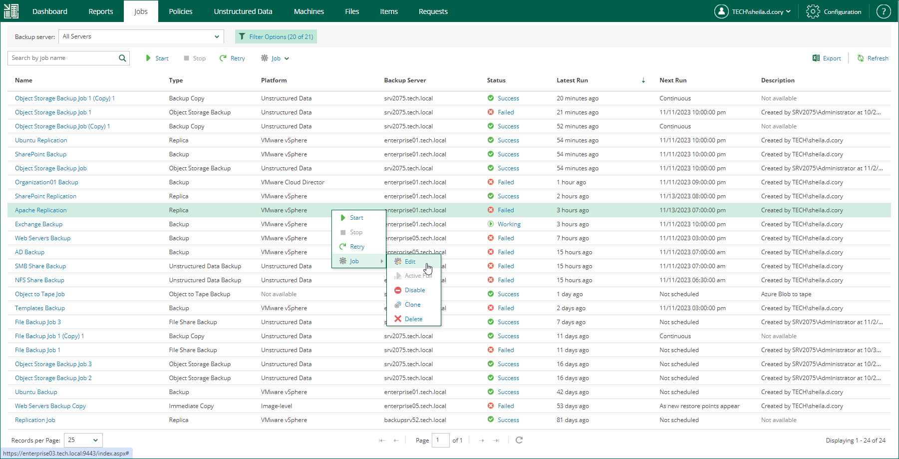

In this article

To launch the wizard for job editing:

1. On Jobs tab, select the necessary job from the list.
2. On the toolbar, click Job to expand the list of available actions.
3. Select Edit.

Alternatively, you can right-click a job and select Job > Edit.

Page updated 9/2/2025

Page content applies to build 13.0.1.1071
