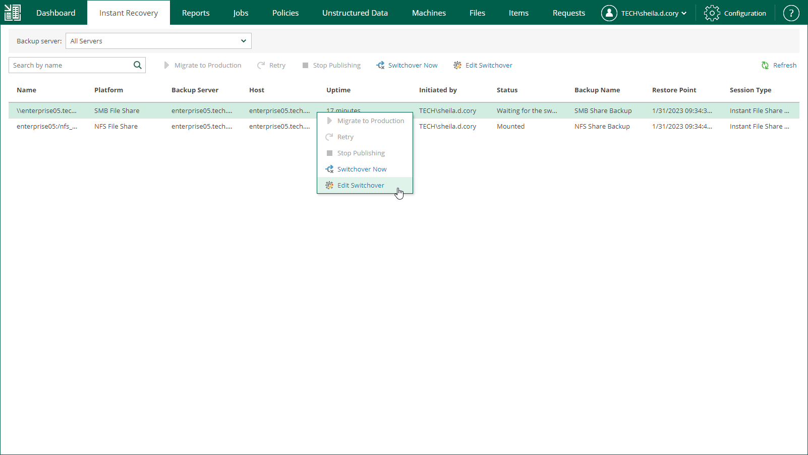

In this article

The following instructions apply if you have selected to switch from the mounted file share to the production file share manually or at the scheduled time at the Switchover step of the Migrate to Production wizard.

To change the time when Veeam Backup & Replication will switch from the mounted file share to the production file share, do the following:

1. Open the Instant Recovery tab and select the necessary file share from the list.
2. On the toolbar, click Edit Switchover.
3. At the Switchover step of the Edit Switchover wizard, select a type of the switchover from the mounted to the migrated file share.

* Automatic — select this option if you want Veeam Backup & Replication to perform the switch automatically right after the entire file share will be restored.
* Manual — select this option if you want to perform the switch manually.
* Scheduled — select this option if you want Veeam Backup & Replication to perform the switchover at a specified date and time.

1. At the Summary step of the Edit Switchover wizard, review the migration settings and click Finish.

Page updated 9/2/2025

Page content applies to build 13.0.1.1071
