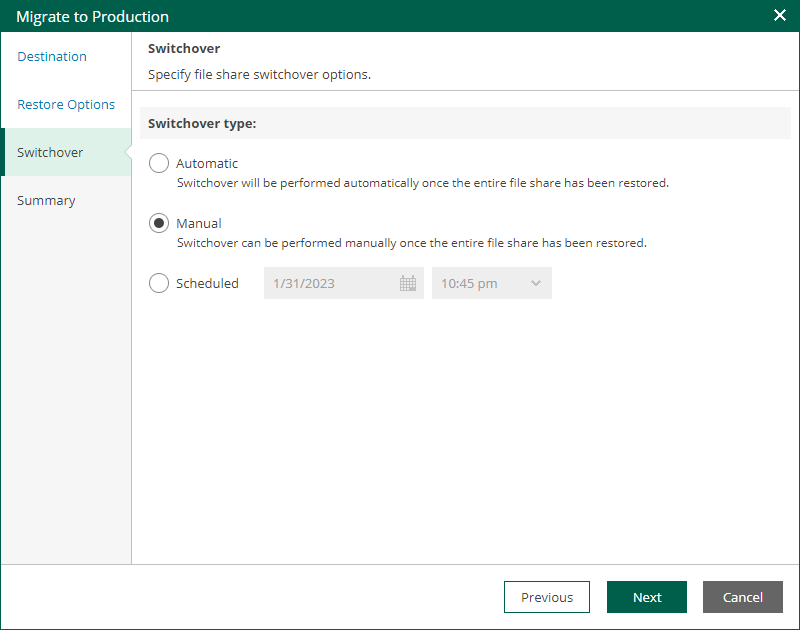

# Step 4. Configure Switchover

At the Switchover step of the wizard, select a type of the switchover from the mounted file share to the migrated file share.

* Automatic — select this option if you want Veeam Backup & Replication to perform the switch automatically right after the entire file share will be restored.
* Manual — select this option if you want to perform the switch manually.
* Scheduled — select this option if you want Veeam Backup & Replication to perform the switchover at a specified date and time.

