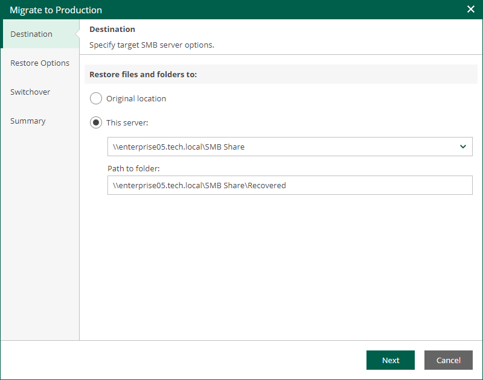

In this article

At the Destination step of the wizard, specify the location to which you want to restore the file share.

* Select Original location to restore data to the location where the file share resided originally. This type of restore is only possible if the original device is connected to Veeam Backup & Replication and powered on.
* Select This server to restore data to another location:

1. From the This server drop-down list, select a file share to which the data must be restored.

You can select any file share added to the backup inventory. If the required file share is missing in the drop-down list, add a new file share to the backup server infrastructure. For more information on how to add a new file share, see the [Adding File Share](https://helpcenter.veeam.com/docs/vbr/userguide/adding_file_share.html?ver=13) section of the Veeam Backup & Replication User Guide.

1. In the Path to file field, specify a path to the folder on the selected file share where the files must be restored.

Page updated 9/4/2025

Page content applies to build 13.0.1.1071
