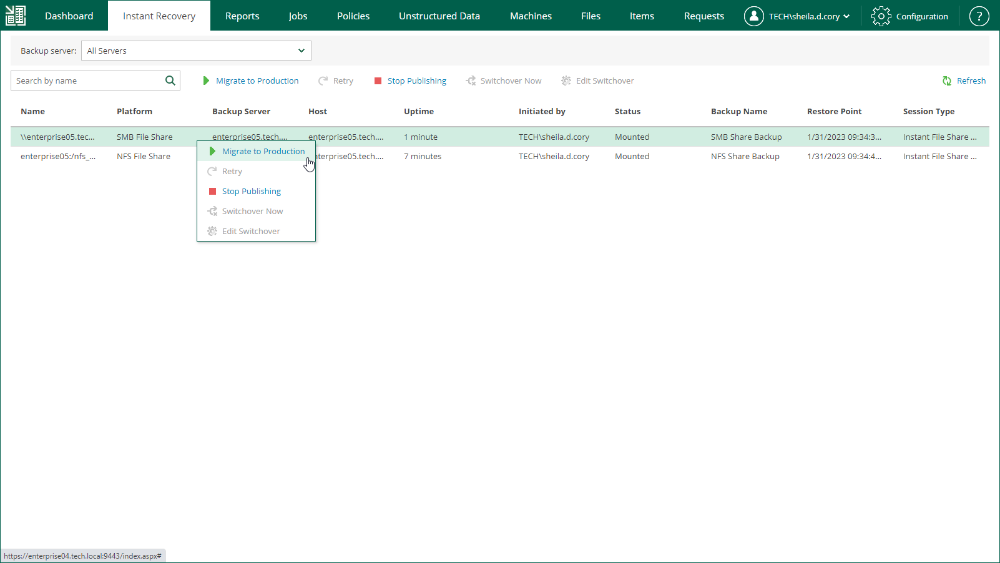

In this article

To launch the Migrate to Production wizard, do the following:

1. Open the Instant Recovery tab and select a file share from the list.
2. On the toolbar, click Migrate to production.

Alternatively, you can right-click a file share and select Migrate to Production.

Page updated 9/2/2025

Page content applies to build 13.0.1.1071
