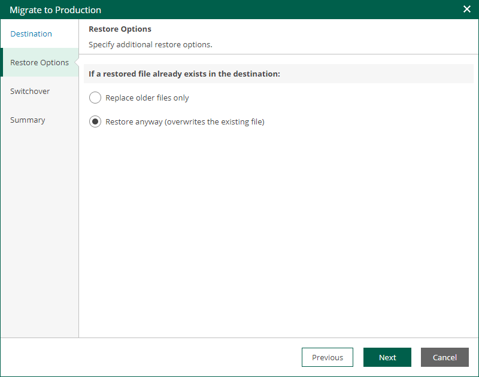

# Step 3. Specify Restore Options

At the Restore Options step of the wizard, specify overwrite options in case the file with the same name already exists in the target folder.

* Replace older files only

Select this option if you want to overwrite the existing file only if it is older than the restored file.

* Restore anyway

Select this option if you want to overwrite the existing file with the restored file in all cases.

