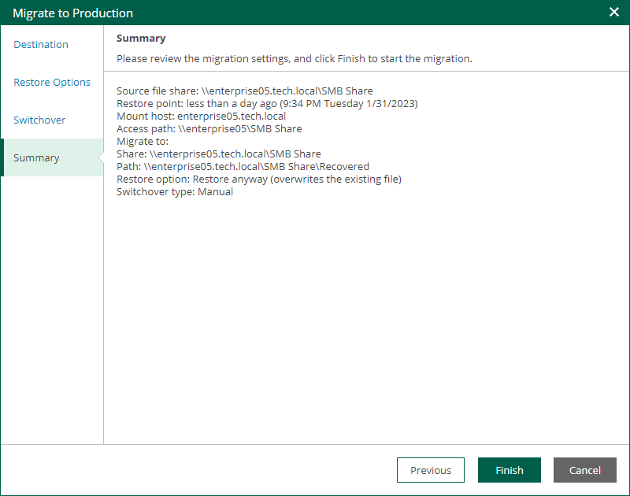

# Step 5. Review Migration Settings

At the Summary step of the wizard, review the migration settings and click Finish. Veeam Backup & Replication will migrate the recovered file share to the specified location.

