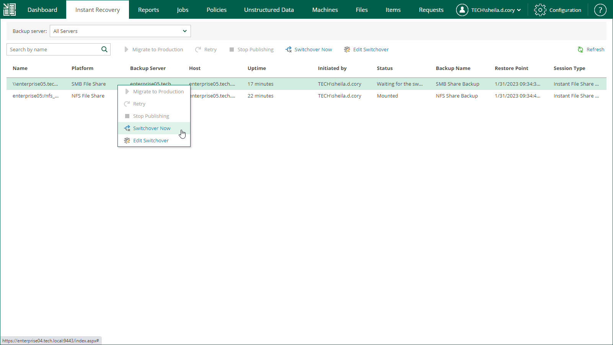

# Switching to Production File Share Manually

The following instructions apply if you have selected to switch from the mounted file share to the production file share manually or at the scheduled time at the Switchover step of the Migrate to Production wizard.

To switch to a production file share, do the following:

1. Open the Instant Recovery tab and select a file share from the list.
2. On the toolbar, click Switchover Now.

Alternatively, you can right-click a file share and select Switchover Now.

