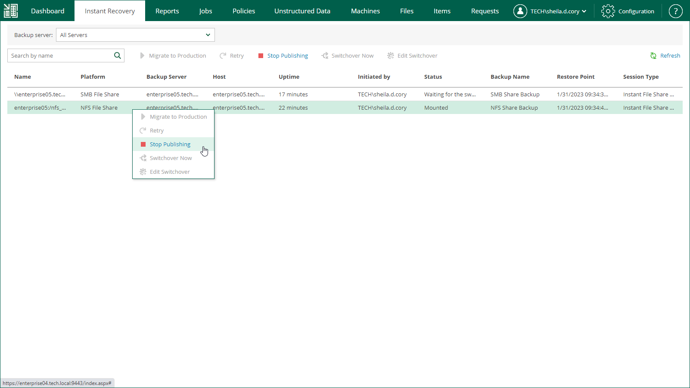

# Unpublishing Recovered File Shares

When you finish reviewing the recovered file shares, you can stop publishing them. This will unmount the recovered file shares from the mount server. Note that all changes made in the recovered file shares will be lost.

To stop publishing a recovered file share, do the following:

1. Open the Unstructured Data tab and select a file share from the list.
2. On the toolbar, click Stop Publishing.

Alternatively, you can right-click a file share and select Stop Publishing.

