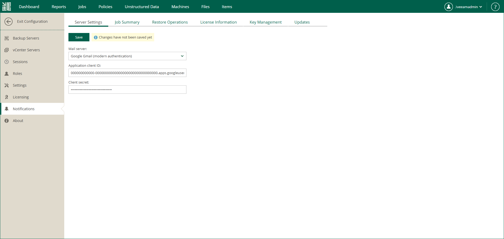

In this article

You can authorize Veeam Backup Enterprise Manager to send email notifications on behalf of your Google account. To send notifications, Enterprise Manager communicates with the Gmail API. For authentication, Enterprise Manager uses an access token issued by Google Authorization Server. To acquire an access token, you need to specify OAuth 2.0 client credentials of the application registered in the Google Cloud console. For more information on obtaining client credentials, see [Registering Application in Google Cloud Console](registering_google_app.md).

To connect Veeam Backup Enterprise Manager with your Google account, do the following:

1. Log in to Enterprise Manager using an administrative account.
2. To open the Configuration view, click Configuration in the upper-right corner.
3. Open the Notifications section on the left of the Configuration view.
4. On the Server Settings tab, select Google Gmail from the Mail server list.
5. In the Application client ID field, specify the obtained client ID.
6. In the Client secret field, specify the client secret.
7. To save the credentials, click Save.
8. Click Sign in with Google.
9. Allow Veeam Backup Enterprise Manager to have access to your Google account and send email notifications on your behalf.

Page updated 11/10/2025

Page content applies to build 13.0.1.1071
