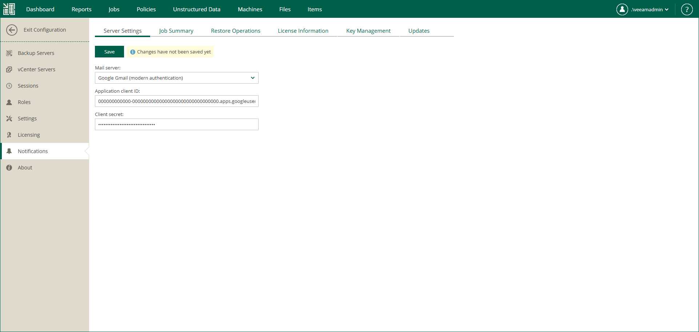

# Google Account Settings

You can authorize Veeam Backup Enterprise Manager to send email notifications on behalf of your Google account. To send notifications, Enterprise Manager communicates with the Gmail API. For authentication, Enterprise Manager uses an access token issued by Google Authorization Server. To acquire an access token, you need to specify OAuth 2.0 client credentials of the application registered in the Google Cloud console. For more information on obtaining client credentials, see [Registering Application in Google Cloud Console](registering_google_app.md).

To connect Veeam Backup Enterprise Manager with your Google account, do the following:

1. Log in to Enterprise Manager using an account with the Portal Administrator role.
2. In the upper-right corner, click Configuration.
3. In the Configuration view, open the Notifications section.
4. On the Server Settings tab, select Google Gmail from the Mail server list.
5. In the Application client ID field, specify the obtained client ID.
6. In the Client secret field, specify the client secret.
7. To save the credentials, click Save.
8. Click Sign in with Google.
9. Allow Veeam Backup Enterprise Manager to have access to your Google account and send email notifications on your behalf.

Page updated 2026-07-21

