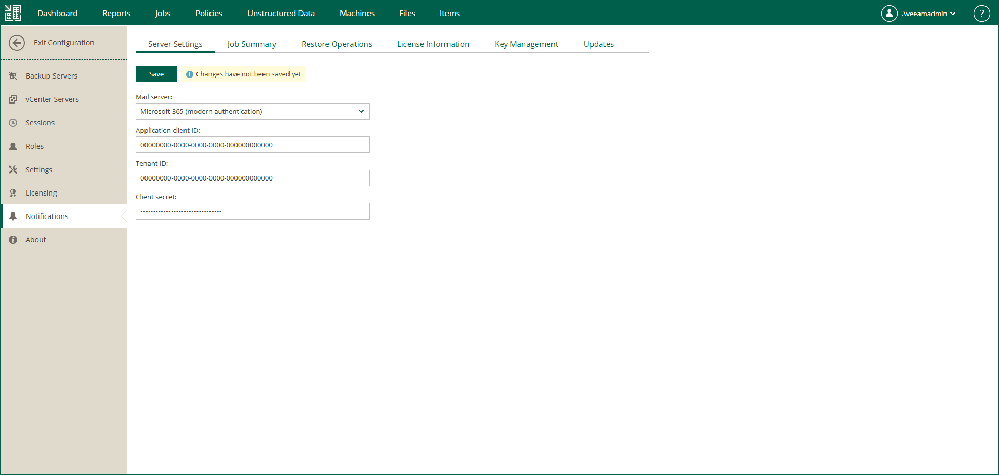

In this article

You can authorize Veeam Backup Enterprise Manager to send email notifications on behalf of your Microsoft 365 account. To send notifications, Enterprise Manager communicates with the Microsoft Graph API. For authentication, Enterprise Manager uses an access token issued by Microsoft identity platform. To acquire an access token, you need to specify details of an application registered with the Microsoft identity platform. For more information on obtaining application details, see [Registering Application in Microsoft Azure Portal](registering_azure_app.md).

To connect Veeam Backup Enterprise Manager with your Microsoft 365 account, do the following:

1. Log in to Enterprise Manager using an administrative account.
2. To open the Configuration view, click Configuration in the upper-right corner.
3. Open the Notifications section on the left of the Configuration view.
4. On the Server Settings tab, select Microsoft 365 from the Mail server list.
5. In the Application client ID field, specify the client ID assigned to your Microsoft Entra application.
6. In the Tenant ID field, specify the ID of your Microsoft Entra tenant.
7. In the Client secret field, specify the client secret assigned to your Microsoft Entra application.
8. To save the settings, click Save.
9. Click Authorize now.
10. Allow Veeam Backup Enterprise Manager to access your Microsoft 365 account and send email notifications on your behalf.

Page updated 11/10/2025

Page content applies to build 13.0.1.1071
