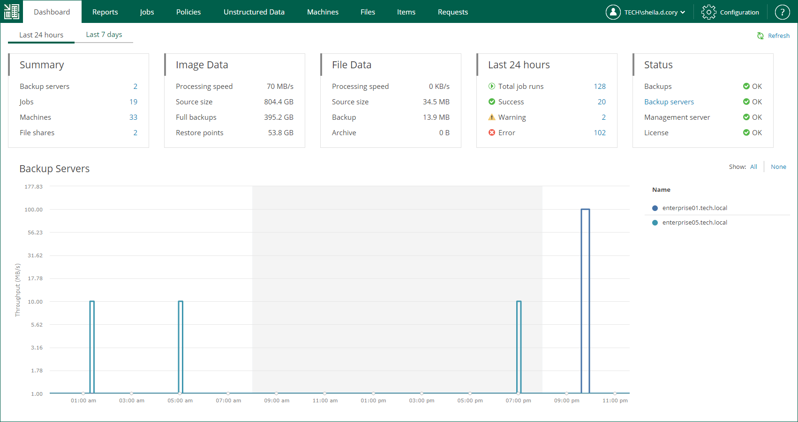

In this article

On the Dashboard tab of the home page, you can see on-going statistics on backup servers and a chart that shows date and time when backup jobs were performed, and the network throughput rate during the backup jobs.

Backup Servers Statistics

Veeam Backup Enterprise Manager displays on-going statistics on backup servers, their jobs, processed machines and file shares as well as data size, processing speed and so on.

You can view statistics for one of the following time ranges:

* Last 24 hours
* Last 7 days

To switch between the ranges, select the necessary tab in the upper-left corner.

The Summary widget contains the following information:

* Backup servers — number of backup servers added to the Enterprise Manager infrastructure.
* Jobs — number of jobs configured on the added backup servers (including backup, backup copy, replication, sure backup, backup to tape and file to tape jobs). This number also includes Veeam Agent backup jobs managed by Veeam Agent.
* Machines — number of machines processed by the backup servers (including VMware VMs, Microsoft Hyper-V VMs, and Veeam Agent machines) and machines that are processed by Veeam Agent backup jobs managed by Veeam Agent. If a machine is processed by multiple jobs, it is counted as a single machine.
* File shares — number of file shares processed by the backup servers.

The Image Data widget contains information about backups of VMware VMs, Microsoft Hyper-V VMs, and Veeam Agent machines managed by backup servers. Note that the data covers all Veeam Agent backup modes: image-level, volume-level and file-level.

* Processing speed — average processing speed.
* Source size — total size of processed machines. If a machine is processed by multiple jobs (including backup copy jobs), it is counted as a single machine.
* Full backups — total size of full backups. This number does not include backups created by backup copy jobs.
* Restore points — total size of incremental backups. This number does not include backups created by backup copy jobs.

The File Data widget contains the following information about unstructured data backups:

* Processing speed — average speed of file share processing.
* Source size — total size of processed source files.
* Backup — total size of backup files.
* Archive — total size backup files moved to the archive repository.

The Last 24 hours / Last 7 days widget reports on the job session results for the selected period.

* Total job runs — total number of job runs.
* Success — number of jobs completed successfully.
* Warning — number of jobs completed with a warning.
* Error — number of failed jobs.

The Status widget contains the following information:

* Backups — status of backups that are verified by SureBackup jobs.
* Backup servers — status of the last collection job session.
* Management server — status of the Veeam Backup Enterprise Manager management server.
* License — status of licenses.

* OK — current license is valid
* Warning — working in grace period, or failed to update the license
* Error — license is expired, and grace period is over

You can use the links in these blocks to drill down into detailed reports on specific aspects of the backup infrastructure.

Backup Servers Chart

The Backup Servers chart shows date and time when backup jobs were performed, and the network throughput rate during the backup jobs. Jobs related to each backup server have their own color on the chart. The legend on the right interprets the color scheme used for all backup servers added to the Enterprise Manager infrastructure.

You can view the chart for one of the time following ranges:

* Last 24 hours
* Last 7 days

To switch between the ranges, select the necessary tab in the upper-left corner.

In the Last 24 hours view, the highlighted part of the chart represents the configured backup window. You can configure the backup window in the chart settings. For more information, see [Customizing Dashboard Chart](customizing_dashboard_chart.md).

Page updated 10/30/2025

Page content applies to build 13.0.1.1071
