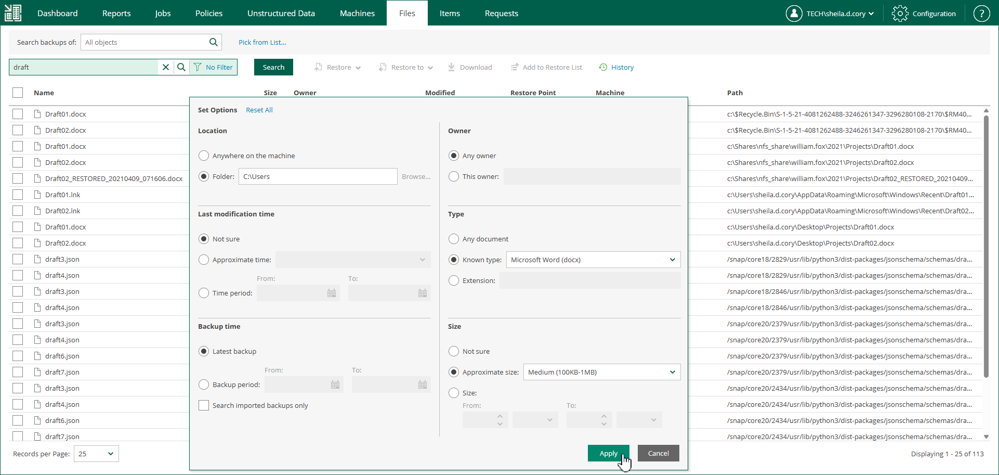

In this article

With advanced search, you can search for files in all restore points of a selected machine backup and filter search results by certain criteria. After you find necessary files, you can select them to perform file restore.

To perform an advanced search, take the following steps:

1. Open the Files tab.
2. If you know the necessary file name or a part of the name, specify it in the search field.
3. To open advanced search options, click No Filter next to the search field.
4. In the Set Options window, define the necessary search criteria:

* Location — select a specific folder on the machine to search in.
* Last modification time — specify approximate time when the file was last modified or set a time interval.
* Backup time — choose to search through the latest backup of the specified machine or all backups of the machine created within a certain time interval.
* Owner — select to search for files with a specific owner.
* Type — select to search for files of specific type or with a certain extension.
* Size — specify approximate size of file or set a size range.

1. To apply the filter, click Apply.
2. Click Search on the right of the search field.

Page updated 4/22/2025

Page content applies to build 13.0.1.1071
