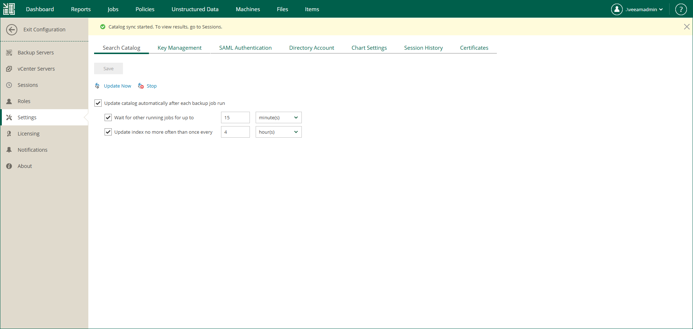

# Performing Catalog Replication and Indexing

Once you have run backup jobs with guest OS file system indexing enabled, perform catalog replication to consolidate index files from multiple backup servers. During this operation, Veeam Backup Enterprise Manager aggregates index data from multiple backup servers and stores them on the Veeam Backup Enterprise Manager server to enable file browsing and search.

|  |
| --- |
| Note |
| Catalog replication is performed for the machines with indexed guest OS file systems on all managed backup servers. |

Veeam Backup Enterprise Manager provides two options to perform catalog replication:

* To perform manual catalog replication, open the Settings tab of the Configuration view and click Update Now on the Search Catalog tab.
* To automatically run catalog replication after every backup job, open the Settings tab of the Configuration view. On the Search Catalog tab, select Update catalog automatically after each backup job run and specify other options as required.

Every run of a catalog replication job initiates a new job session which can be tracked on the Sessions tab of the Configuration view. To view detailed information for a specific session, select it in the list of sessions and click the link in the Status column.

