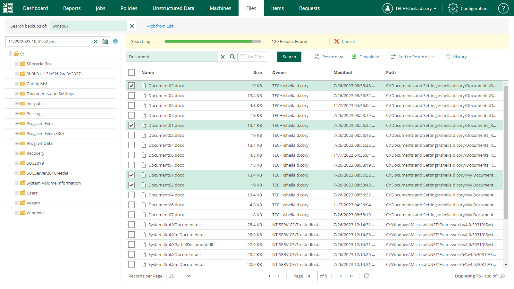

In this article

With simple search, you can search for files in a selected restore point of a selected machine backup. After you find necessary files, you can select them to perform file restore.

To perform simple search, do the following:

1. Open the Files tab.
2. In the Search backups of field, enter the name of a machine whose files you want to restore or click the Pick from List link and select the necessary machine in the Select Object window.
3. In the search field, enter the name of the necessary file or a part of it.
4. To view the search results, press [Enter] or click Search.

Page updated 1/11/2024

Page content applies to build 13.0.1.1071
