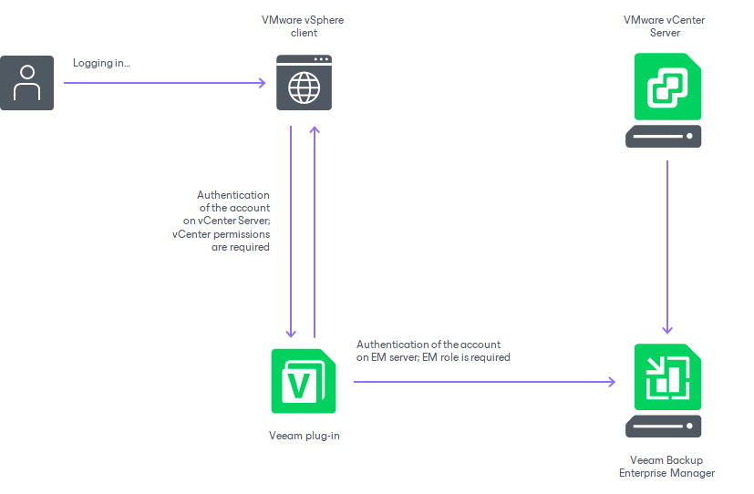

In this article

Veeam Plug-in for VMware vSphere Client is installed remotely on the Veeam Backup Enterprise Manager server. While deploying the plug-in, the installer registers the plug-in as an extension on the vCenter Server, and the vCenter Server downloads the plug-in manifest file. This lets the vsphere-ui service define where the plug-in extends the VMware vSphere Client UI. The back-end service of the plug-in runs on the Enterprise Manager server.

When using the plug-in, consider that authentication process includes the following stages:

1. A user logs in to VMware vSphere Client. To work with the Veeam Plug-in, this user account must be a member of the vCenter Server role that is paired with an Enterprise Manager role. For more information on assigning Enterprise Manager roles, see [Configuring VMware vSphere Roles](configuring_vmware_vsphere_roles.md).
2. Veeam Plug-in connects to Veeam Backup Enterprise Manager, and Veeam Backup Enterprise Manager verifies the user account. The account must have sufficient security permissions to perform the necessary backup operation (VeeamZIP or Quick Backup).

Page updated 9/4/2025

Page content applies to build 13.0.1.1071
