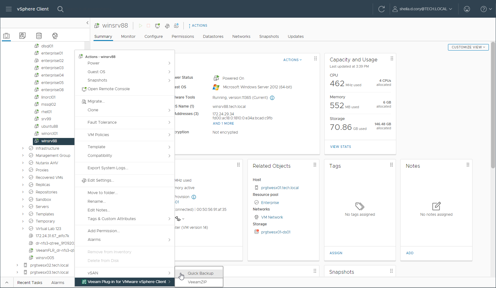

In this article

You can use Veeam Plug-in for VMware vSphere Client to create a quick backup for the selected VM. For more information on quick backup, see the [Quick Backup](https://helpcenter.veeam.com/docs/vbr/userguide/quick_backup.html?ver=13) section of the Veeam Backup & Replication User Guide.

You can perform quick backup for any VM that meets the following requirements:

* A backup job processing the VM exists on the backup server that is added to Veeam Backup Enterprise Manager.
* There is a full backup file for this VM in the backup repository.

To perform quick backup, do the following:

1. In VMware vSphere Client, open the vCenter Server inventory.
2. In the inventory tree, select a VM.
3. Right-click the VM and select Veeam Plug-in for VMware vSphere Client > Quick Backup.

This will trigger a backup job processing the selected VM to create a new incremental restore point (VIB file) for the latest full backup found in the repository for this VM. Details of a running quick backup task can be seen in the Recent Tasks pane on the right.

|  |
| --- |
| Note |
| A quick backup job fails to start if the Location property of the VM and backup repository do not match — for example, if you try to use a repository with location set to Sydney to back up a VM with location set to Helsinki. To read more about location settings, refer to the Veeam Backup & Replication User Guide. |

Page updated 9/2/2025

Page content applies to build 13.0.1.1071
