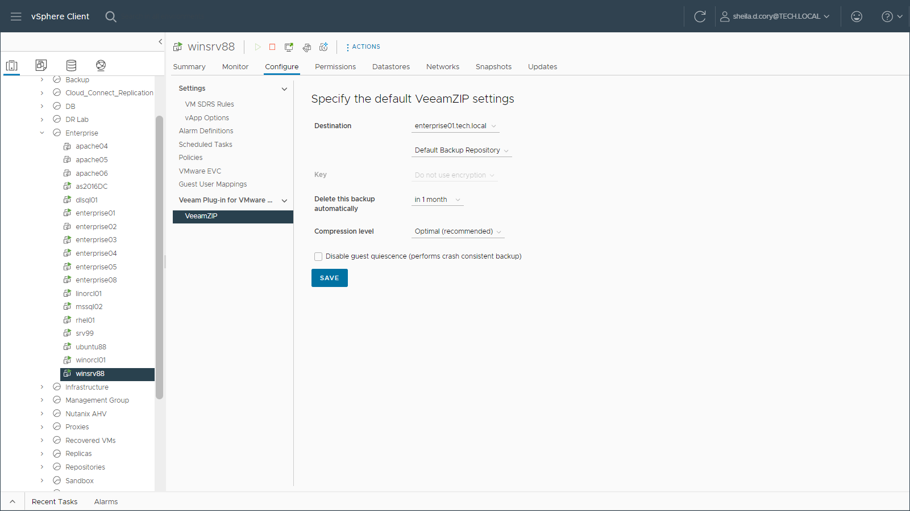
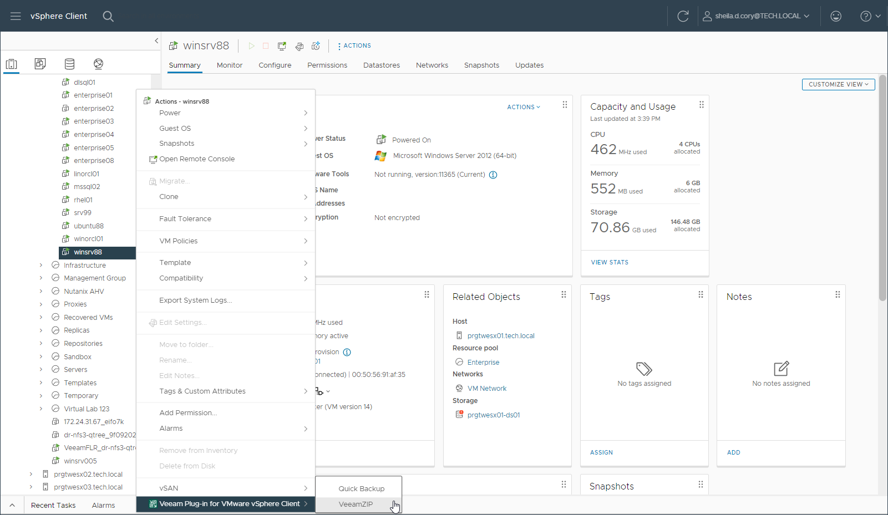
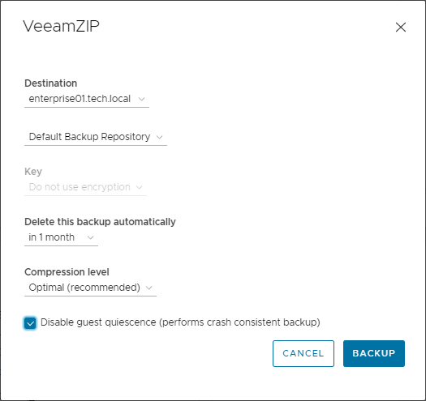

In this article

You can use Veeam Plug-in for VMware vSphere Client to create an ad-hoc VeeamZIP backup of a VM. For more information on VeeamZIP, see the [VeeamZIP](https://helpcenter.veeam.com/docs/vbr/userguide/veeamzip.html?ver=13) section of the Veeam Backup & Replication User Guide.

Configuring VeeamZIP Settings

Before you create a full VM backup with VeeamZIP, you need to configure VeeamZIP settings. The specified configuration is stored for the user account in your browser settings.

To configure the VeeamZIP settings, do the following:

1. In VMware vSphere Client, open the vCenter Server inventory.
2. In the inventory tree, select a VM.
3. On the Configure tab, select Veeam Plug-in for VMware vSphere Client > VeeamZIP.

Alternatively, you can right-click the VM and select Veeam Web Client plug-in > VeeamZIP.

1. In the Destination section, select the Veeam backup server that will process the VM and the repository where to store the VeeamZIP file.

The plug-in displays Veeam backup servers added to the Veeam Backup Enterprise Manager infrastructure and backup repositories created in the backup infrastructure of these backup servers.

1. In the Key section, specify the encryption key if necessary.
2. In the Delete this backup automatically section, specify whether the resulting backup file should be automatically deleted after a certain time interval.
3. In the Compression level section, select the necessary compression level for the backup.
4. By default, the Disable guest quiescence option is selected, meaning that guest OS quiescence is deactivated. If you want a crash-consistent backup, leave it that way.

If you want, however, an application-consistent backup, then clear the Disable guest quiescence check box, and Veeam will create a transactionally consistent image of VMs using VMware Tools quiescence for guest OS.

For more information about guest OS quiescence, see the [VMware Tools Quiescence](https://helpcenter.veeam.com/docs/vbr/userguide/tools_quiescence.html?ver=13) section of the Veeam Backup & Replication User Guide.

1. Click Save.

Creating Full VM Backup with VeeamZIP

To create a full VM backup with VeeamZIP, do the following:

1. In vSphere Client, the vCenter Server inventory.
2. In the inventory tree, right-click the VM that you want to back up and select Veeam Web Client plug-in > VeeamZIP.

1. If you have already configured VeeamZIP settings, review the settings and click Backup.

If you have not configured VeeamZIP settings, specify the settings in the VeeamZIP window in the same way as described in the [Configuring VeeamZIP Settings](#set_veeamzip).

You can view the backup creation progress in the Recent Tasks pane of vSphere Client.

|  |
| --- |
| Note |
| A VeeamZIP job fails to start if the Location property of the VM and backup repository do not match — for example, if you try to use a repository with location set to Sydney to back up a VM with location set to Helsinki. To read more about location settings, refer to the Veeam Backup & Replication User Guide. |

Page updated 9/4/2025

Page content applies to build 13.0.1.1071
