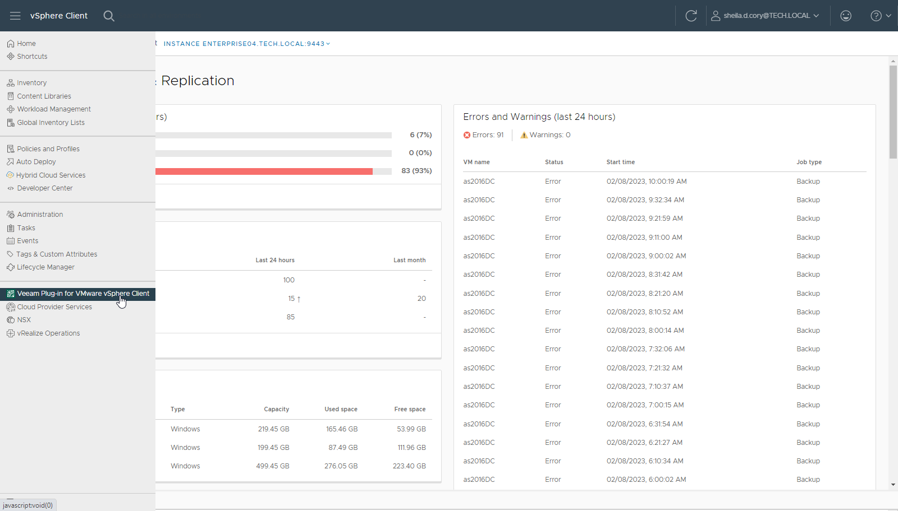

In this article

To access the plug-in, open the VMware vSphere Client and select Veeam Plug-in for VMware vSphere Client from the menu.

Make sure, the account used to access the plug-in has permissions to connect to the Veeam Backup Enterprise Manager server and (optionally) Veeam ONE server.

* To launch the plug-in and successfully obtain statistics from Veeam Backup Enterprise Manager, you need to pair a vCenter Server role with an Enterprise Manager role. Then you can use an account with this vCenter Server role to log in to the vSphere Client and access the plug-in. For more information on assigning Enterprise Manager roles, see [Configuring VMware vSphere Roles](configuring_vmware_vsphere_roles.md).

* To create a VeeamZIP backup or Quick Backup, the Portal Administrator or Portal User role is required.

* To browse backup infrastructure, the Restore Operator role is enough.

* If you have Veeam ONE deployed in your environment and you want to open Veeam ONE reports from the plug-in (optional capability), the accounts used to log in to the vSphere Client must be also included in the Veeam ONE Power Users, Veeam ONE Read-Only Users or Veeam ONE Administrators group on the machine where Veeam ONE Server is installed. For more information, see the [Security Groups](https://helpcenter.veeam.com/docs/one/userguide/security_groups.html?ver=13) section of the Veeam ONE Deployment Guide.

Page updated 9/2/2025

Page content applies to build 13.0.1.1071
