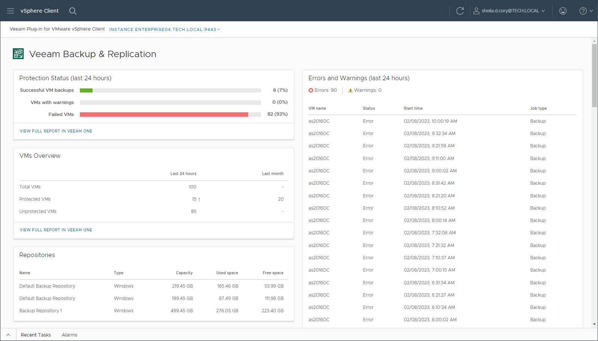

# Examining Backup Infrastructure

On the Veeam Plug-in for VMware vSphere Client main page, you can view statistics on the Veeam Backup & Replication infrastructure. The statistics are shown for the VMs that are included in the restore scope specified for your vCenter Server role. For more information on the restore scope, see [Configuring VMware vSphere Roles](configuring_vmware_vsphere_roles.md).

You can view the following statistics:

* Protection Status — statistics on the status of VM backup and replication jobs for the last 24 hours.

* Successful VM backups — number of successfully backed up or replicated VMs
* VMs with Warnings — number of VMs that were backed up or replicated with a warning
* Failed VMs — number of VMs that were backed up or replicated with an error

* Errors and Warnings — statistics on backup and replication sessions that completed with a warning or error for the last 24 hours.
* VMs Overview — statistics about all available VMs for the last 24 hours and last month.

* Total VMs — number of all available VMs
* Protected VMs — number of VMs that were backed up or replicated
* Not protected VMs — number of VMs that were not backed up or replicated

* Repositories — information about backup repositories, including repository name, type, overall capacity, backup size and free space.
* Active Sessions — statistics about all active backup and replication sessions for all vCenter Server VMs.

