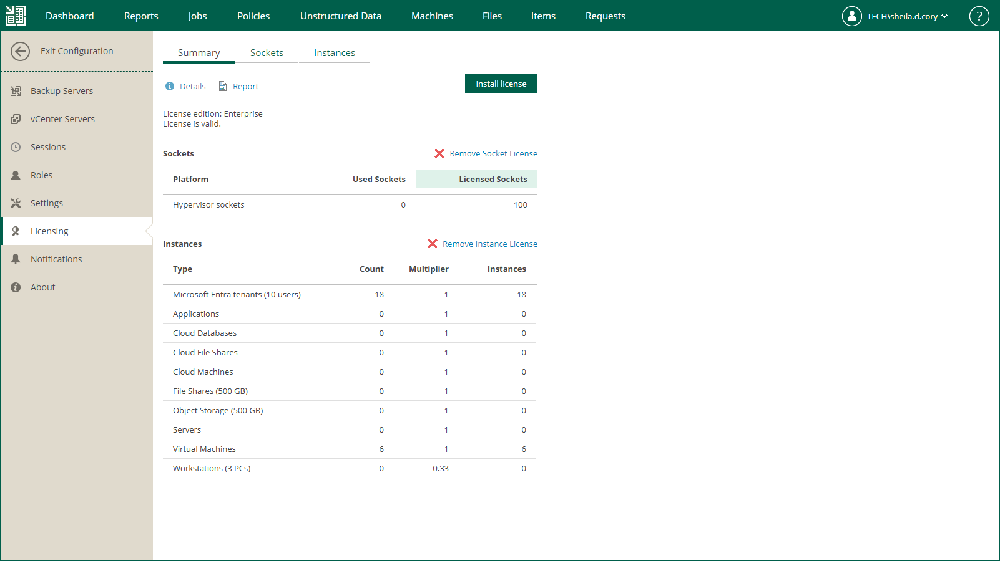

# Removing License

Since Veeam Backup Enterprise Manager does not work without a license, you cannot remove an installed license completely. You can replace the already installed license by installing a new one.

If you have a merged license installed, you can remove a part of it: a socket license or an instance license. After you remove a part of the merged license, Veeam Backup Enterprise Manager and connected backup servers will operate under the other part of the merged license.

To remove a part of a merged license, do the following:

1. Sign in to Veeam Backup Enterprise Manager using an account with the Portal Administrator role.
2. To open the Configuration view, click Configuration in the upper-right corner.
3. In the Configuration view, open the Licensing section.
4. On the Summary tab, click Remove Socket License or Remove Instance License.
5. To confirm the removal, click Yes.

