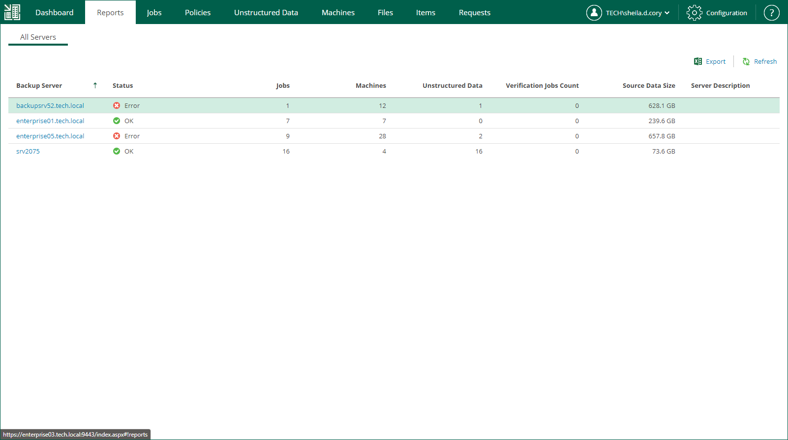

In this article

On the Reports tab, you can view statistical information about backup servers added to the Enterprise Manager infrastructure.

For each backup server, the report contains the following data.

| Parameter | Description |
| --- | --- |
| Backup Server | Name of the backup server. |
| Status | Status of the last data collection job session for the backup server. For more information on data collection, see [Collecting Data from Backup Servers](collecting_data_from_backup_servers.md).  Possible values:   * Never processed — data collection has never been started for the backup server * Processing — data collection is in progress * OK — data was collected successfully * Warning — data collection completed with a warning * Error — data collection failed |
| Jobs | Number of jobs on the backup server. |
| Machines | Number of machines processed by the backup server, including the machines from imported or orphaned backups. |
| Unstructured Data | Number of object storage systems and file shares processed by the backup server, including the file shares from imported or orphaned backups. |
| Verification Jobs Count | Number of SureBackup jobs on the backup server. |
| Source Data Size | Size of source data processed by the backup server. |
| Server Description | Backup server description that was specified when adding the server to the Enterprise Manager infrastructure. |

You can drill down into this data by clicking a link in the Backup Server column to move through the levels in the following succession: Backup servers > Jobs > Job sessions > Session details. Each level contains a list of entries with details for that particular level.

|  |
| --- |
| Note |
| You can export displayed information to a file using the Export link on the toolbar. To open the file on your machine, use the associated application. |

Page updated 1/11/2024

Page content applies to build 13.0.1.1071
