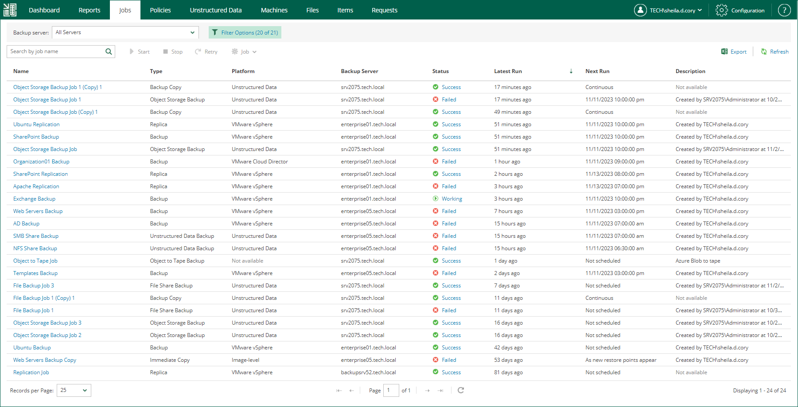

In this article

From Veeam Backup Enterprise Manager, you can view information about jobs configured on all backup servers added to Enterprise Manager. To view the jobs, open the Jobs tab. Every job in the list is described with the following data: job name, type, platform of the objects it processes, backup server on which the job was created, current job status, date of the latest run, date of the next run (if the job is scheduled) and job description.

To quickly find a job, you can use filters and the search field.

* To view jobs of a specific backup server, select the server from the Backup server drop-down list.
* To filter job by job types or job statuses, use the Filter Options filter.

Once you have selected necessary job types and statuses, click Apply to apply the filter.

* To find a job by its name, use the search field.

Besides the information presented in the list of jobs, the Jobs tab allows you to view advanced job data:

* To see a list of job sessions, click the job name link in the Name column.
* To see detailed statistics on the last job run, click the state link in the Status column.

|  |
| --- |
| Note |
| You can export displayed information to a file using the Export link on the toolbar. This file then can be opened on the client machine using the associated application. |

Page updated 11/10/2023

Page content applies to build 13.0.1.1071
