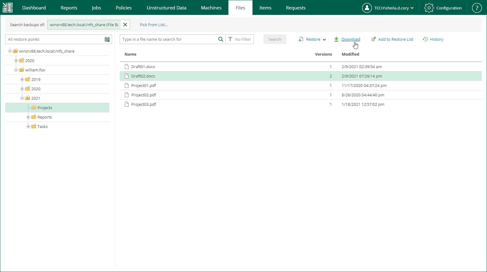
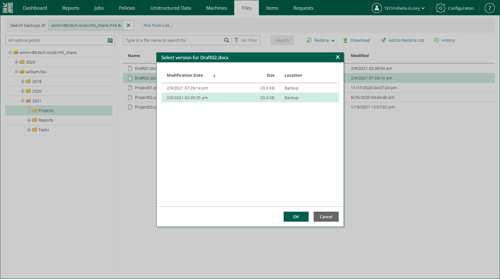
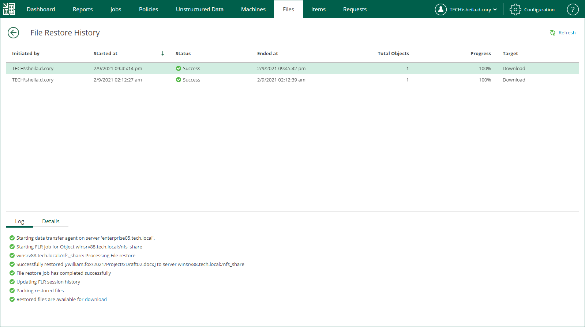

In this article

If you choose to download a file, Veeam Backup Enterprise Manager interacts with the backup server to extract the necessary file from the backup. The user who initiated the restore will be able to download the file to the local machine, that is, the Enterprise Manager server.

To download a file, do the following:

1. Locate the necessary file using browse or search possibilities of Enterprise Manager. For details, see [Viewing Unstructured Data Backups](em_managing_file_shares_view.md) and [Browsing for Items in Unstructured Data Backups](em_managing_file_shares_browse.md).
2. Click Download.

1. If you browse items in all restore points created for the data source, and the restore points contain multiple versions of the item, Enterprise Manager will prompt you to select the item version. In the Select version window, select the restore point that contains the necessary item version and click OK.

1. In the displayed window, click Yes.
2. Wait for restore session to complete and the item to be retrieved from the backup.
3. Select the item from the list.
4. On the Log tab of the File Restore History view, click the download link in the Restored files are available for download record of the session log.

The file is saved to the default download folder on your local machine.

If you download a single file, it is also saved in the %ProgramData%\Veeam\Backup\WebRestore folder. Multiple files are packed in a ZIP file named FLR\_<date>\_<time>.zip and stored in the same folder. Veeam Backup Enterprise Manager cleans up the folder periodically. Files older than 24 hours are automatically deleted. To change the default storage folder, contact [Veeam Customer Support](https://www.veeam.com/support.html).

Page updated 6/18/2024

Page content applies to build 13.0.1.1071
