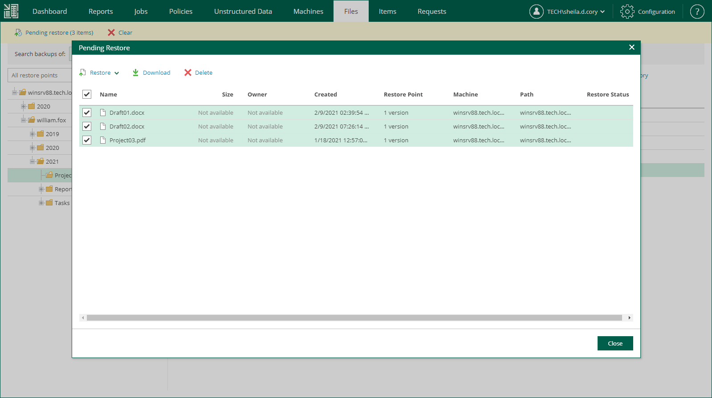

In this article

In addition to restoring single files from selected restore points, Veeam Backup Enterprise Manager supports bulk restore. If you need to restore multiple files at once, you can select more than one file in the preview pane when browsing, and then use the Restore command, or add the necessary files to the restore list and then restore all files at once. Unlike the Restore command, using the restore list helps you to prepare for restore files from different data sources and restore points.

To add a file to the restore list:

1. Locate the necessary file using browse or search possibilities of Veeam Backup Enterprise Manager. For details, see [Viewing Unstructured Data Backups](em_managing_file_shares_view.md) and [Browsing for Items in Unstructured Data Backups](em_managing_file_shares_browse.md).
2. Click Add to Restore List.
3. If you browse items in all restore points created for the data source, and the restore points contain multiple versions of the item, Enterprise Manager will prompt you to select the item version. In the Select version window, select the restore point that contains the necessary item version and click OK.

|  |
| --- |
| Note |
| You cannot add multiple versions of the same file to the restore list using the Select version window. If you want to restore multiple versions of a file, browse to this file in a specific restore point and add this file to the restore list. |

When a file is added to the restore list, the Pending restore notification appears at the top of the Enterprise Manager UI window.

To restore files added to the restore list:

1. In the restore list notification, click Pending restore.
2. In the Pending Restore window, select check boxes next to the files that you want to restore. Use the check box next to the header of the Name column to select all files in the list at once.

If you want to remove a file from the restore list, select the file and click Delete.

1. Click the Restore or Download link to perform the necessary restore operation for the selected files.
2. In the displayed window, click Yes.
3. [For the download operation] Wait for restore session to complete. On the Log tab of the File Restore History view, click the download link.

The files are saved to the default download folder on your local machine.

Multiple files are also saved in a ZIP file named FLR\_<date>\_<time>.zip in the %ProgramData%\Veeam\Backup\WebRestore folder. Veeam Backup Enterprise Manager cleans up the folder periodically. Files older than 24 hours are automatically deleted. To change the default storage folder, contact [Veeam Customer Support](https://www.veeam.com/support.html).

|  |
| --- |
| Tip |
| Veeam Backup Enterprise Manager keeps links for downloaded files in the history for one day. To download a file that was previously restored:   1. On the Files tab, click History. 2. In the File Restore History view, select the necessary restore session. 3. On the Log tab, click the download link. |

Page updated 6/18/2024

Page content applies to build 13.0.1.1071
