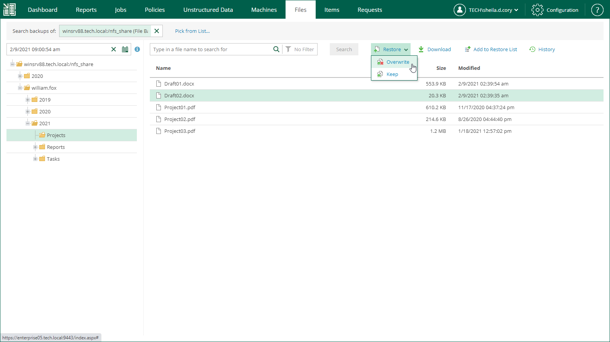

# Restoring Files to Original Location

In this restore scenario, Veeam Backup Enterprise Manager will extract a file from the backup and restore it to the original location in the file share or object storage. Restoring files to the original location is the most secure recovery method, as the user who initiates the restore operation in the Enterprise Manager UI cannot access the file itself.

To restore a file to the original location, do the following:

1. Locate the necessary file using browse or search possibilities of Veeam Backup Enterprise Manager. For details, see [Viewing Unstructured Data Backups](em_managing_file_shares_view.md) and [Browsing for Items in Unstructured Data Backups](em_managing_file_shares_browse.md).

You can select multiple files in file shares. Selection of multiple object storage items is not available.

1. Click Restore and select how to restore the selected items:

* If you select Overwrite, the item from the backup will replace the original item in the data source.
* If you select Keep, the item from the backup will be restored next to the original item in the data source. The restored item will have the \_RESTORED\_<date>\_<time> suffix in its file name.

1. If you browse items in all restore points created for the data source, and the restore points contain multiple versions of the item, Enterprise Manager will prompt you to select the item version. In the Select version window, select the restore point that contains the necessary item version and click OK.

1. In the displayed window, click Yes.

Veeam Backup Enterprise Manager will start the restore operation and display the progress and result of the operation in the File Restore History view.

