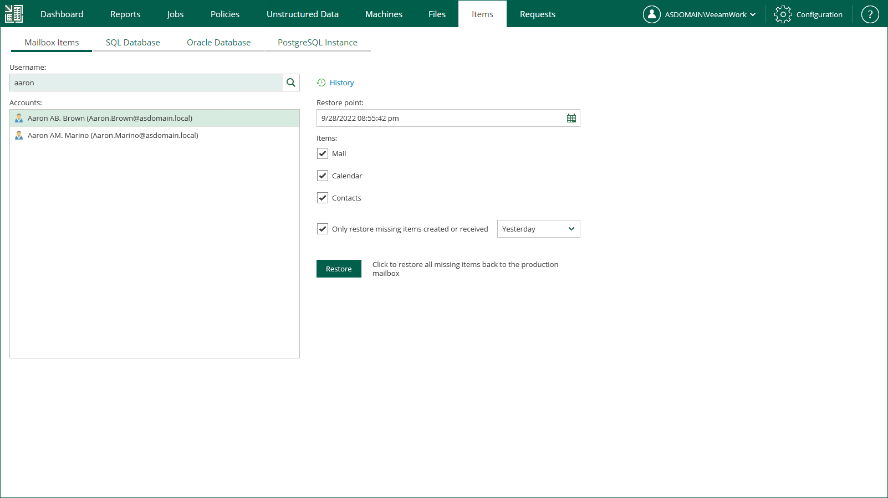

In this article

You can restore Microsoft Exchange items (emails, tasks, calendars) from backups and replicas of Microsoft Exchange Server machines.

You can restore Microsoft Exchange items located in different domains. To use this feature, you must be able to provide a specific Microsoft Active Directory account to restore your data in the necessary domain. For that, select the Prompt for AD account credentials every time option when configuring Active Directory account settings. For more information, see [Configuring Permissions for File and Application Item Restore](configuring_restrictions_for_restore.md#ConfiguringActiveDirectoryAccount).

Before restoring application items, read the [considerations and limitations](em_backup_restore_app_items.md#BeforeYouBegin).

Performing Restore

To restore a Microsoft Exchange item to the production Microsoft Exchange Server, take the following steps:

1. Open the Items tab and click Mailbox Items.
2. In the Username field, enter the account of Active Directory user whose mailbox you want to restored.

You can leave the Username field empty and click the search icon to display all mailboxes that currently exist in the production environment, or enter a search criteria.

1. If you have preconfigured a Microsoft Active Directory account for Microsoft Exchange item restore, Enterprise Manager will use this account for browsing mailbox items and restore. For more information, see [Configuring Permissions for File and Application Item Restore](configuring_restrictions_for_restore.md#ConfiguringActiveDirectoryAccount).

If you have not preconfigured the account, specify the following settings in the Mail Server Credentials window:

1. In the Domain field, enter a name of the domain that the Microsoft Exchange machine belongs to.
2. In the Username field, specify an account name in the following format: DOMAIN\USERNAME. The account must have necessary permissions. For details, see the [Permissions](https://helpcenter.veeam.com/docs/vbr/userguide/vex_required_permissions.html?ver=13) section of the Veeam Explorers User Guide.
3. In the Password field, enter a password of the specified user account.
4. Select Remember credentials for the current session to use these credentials for all mailbox items restore operations during the current login session.

Enterprise Manager uses Global Catalog to examine Active Directory database and find the specified user mailbox, as well as the DNS name for the Exchange Server where the data should be restored. Then it looks for the VM backup or replica and its restore points.

1. To specify a restore point from which to restore the database, in the Restore point field, click the calendar icon and select the necessary date and a restore point created on that date. By default, the latest valid restore point is selected.

|  |
| --- |
| Note |
| Consider the following:   * Restore points on tape are not supported (only those stored in repository can be used).  * If the specified user mailbox does not exist in the restore point, Veeam Backup Enterprise Manager will display an error message. |

1. In the Items section, select the type of item you want to restore:

* Mail
* Calendar
* Contacts

1. To restore only missing items created or received during a certain period, select the Only restore missing items created or received <time period> check box and select the period from the drop-down list.
2. Click Restore. Items that meet the specified conditions will be restored to the production Exchange Server.

To view a restore session log, click History.

Page updated 9/4/2025

Page content applies to build 13.0.1.1071
