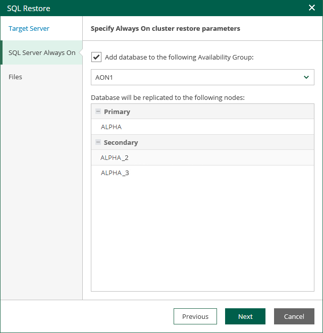

# Step 3. Specify AlwaysOn Restore Settings

The SQL Server Always On step of the wizard is available if the specified target SQL Server supports AlwaysOn Availability Groups.

At this step of the wizard, you can add the restored database to an Availability Group.

1. Select the Add the database to the following Availability Group check box and select an availability group from the drop-down list.
2. In the Database will be replicated to the following nodes list, review information about the primary and secondary nodes of the availability group.

During the restore process, Veeam Backup & Replication will restore the database to the primary server and then replicate it to secondary nodes.

If you do not plan to use the AlwaysOn capabilities when restoring a database, clear the Add the database to the following Availability Group check box.

