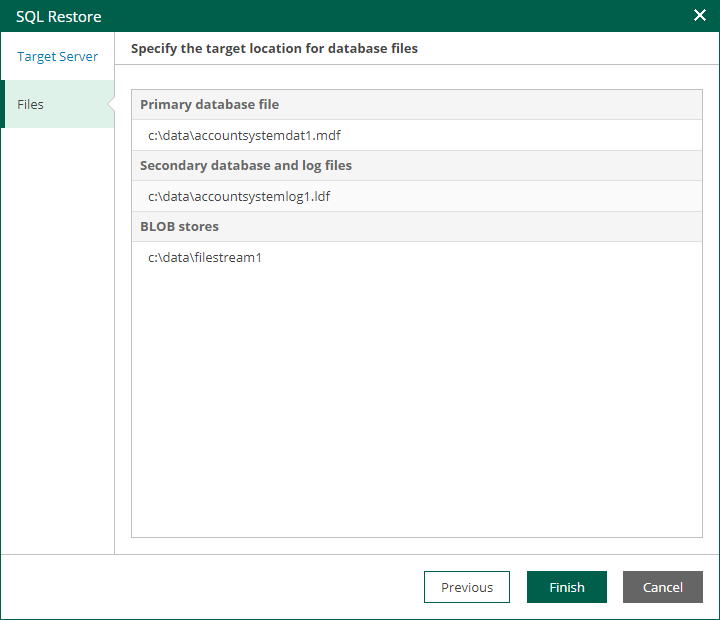

In this article

At the Files step of the wizard, you can specify paths to database files on the target server. You can specify separate target locations for the primary database file and secondary database file with logs. Then, click Finish to start the restore operation.

To view the status of the restore process, on the Items tab, click History.

Page updated 9/4/2025

Page content applies to build 13.0.1.1071
