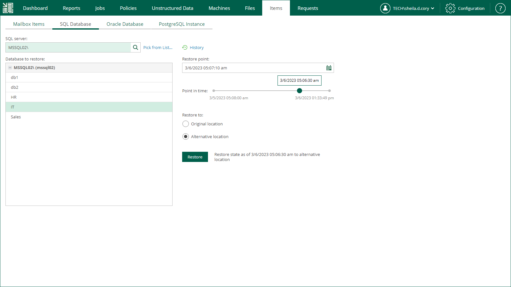

# Step 1. Launch SQL Restore Wizard

To launch the SQL Restore wizard, do the following:

1. Open the Items tab and click SQL Database.
2. In the SQL Server field, enter a name of Microsoft SQL Server hosting the database you need to restore; use the server\_name\instance\_name format.

Alternatively, click the Pick from List link to a machine from the list of available Microsoft SQL Server backups.

1. From the Database to restore list, select the database you need. Consider that user credentials for carrying out the restore procedure will be picked as follows:

1. Veeam Backup Enterprise Manager will try to use the account of the backup job that contains the Microsoft SQL Server machine.
2. If this account does not have sufficient rights to perform the restore procedure (for example, in case of imported backup), user will be prompted to provide the necessary credentials.

The security role specified for this account in Enterprise Manager must allow the user to restore Oracle databases. For more information, see [Configuring Permissions for File and Application Item Restore](configuring_restrictions_for_restore.md).

1. To specify a restore point from which to restore the database, in the Restore point field, click the calendar icon and select the necessary date when backup was performed and a restore point created on that date. By default, the latest valid restore point is selected.
2. For a database backed up with transaction log backup turned on, you can also select the necessary point in time using the Point in time slider. The slider displays the following timestamps (relative to the currently selected restore point):

* The beginning point refers to the previous restore point of the Microsoft SQL Server machine that contains the selected database backup. If the previous restore point (server backup) is not found, or the database backup does not exist in it, then the beginning point refers to the current restore point.

* The ending point refers to the next restore point that contains the selected database backup. If the next restore point (server backup) and the associated transaction log backup are not found, or if the database backup does not exist in the server backup, then the ending point will refer to the current restore point. If the next restore point (server backup) is not found, but the transaction log backup exists for the preceding period, then the ending point refers to the latest log backup time.

For more information on configuring transaction log backup, see [Microsoft SQL Server Transaction Log Settings](jobs_aap_sql.md).

1. In the Restore to section, select the Alternative location option.
2. Click Restore.

