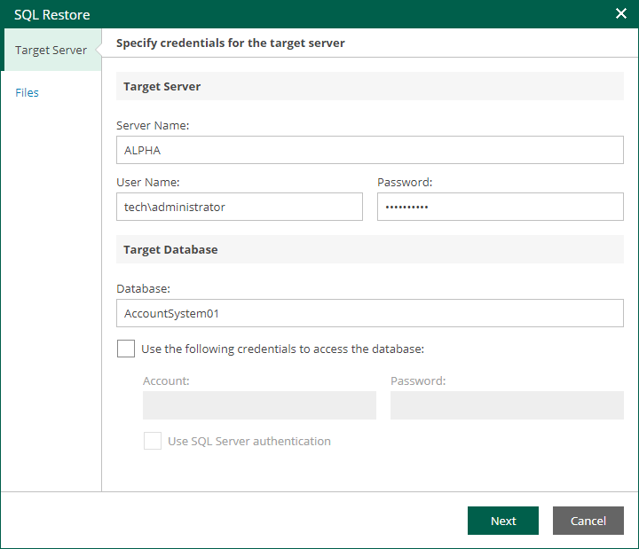

In this article

At the Target Server step of the wizard, specify settings to connect to the target server and the database.

1. In the Target Server section, enter the name of the Microsoft SQL Server or Microsoft SQL Server instance in the <server IP or FQDN>\<instance name> format, and credentials of the account that will be used to connect to the target server.

If the SQL Server instance is assigned a custom port, and Microsoft SQL Browser is not running on the machine, specify the instance port in the following format: <server IP or FQDN>,<port>.

1. In the Target Database section, specify the following database connection settings:

1. In the Database field, enter the name of the target database.
2. To use a separate account for connection to the target database, select the Use the following credentials to access the database check box and specify credentials of the necessary account.
3. To use Microsoft SQL Server authentication when connecting to the database, select the Use SQL Server authentication check box.

Page updated 9/4/2025

Page content applies to build 13.0.1.1071
