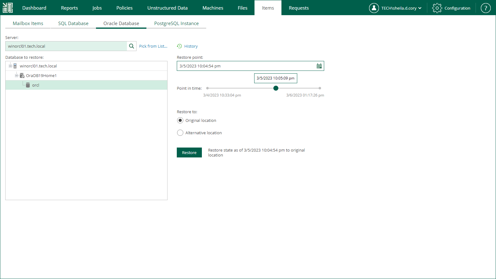

# Restore to Original Location

This scenario allows you to restore an Oracle database to the original location.

When performing database restore to the original location, a temporary iSCSI connection is established between the target Oracle server (it acts as an iSCSI initiator) and mount server associated with the backup repository (it acts as an iSCSI target). For that, Veeam opens a TCP port from the port range 3260-3270; it closes this port after restore session is over.

Consider that user credentials for carrying out the restore procedure will be picked as follows:

1. Veeam Backup Enterprise Manager will try to use the account of the backup job that contains the Oracle server machine or the account you are currently logged in.
2. If this account does not have sufficient rights to perform the restore procedure (for example, in case of imported backup), you will be prompted to supply the necessary credentials. Make sure the account has access to the original machine guest OS (Windows or Linux); if restoring an Oracle 12 Database on Windows server, then you may need to enter password for Oracle home.

The security role specified for this account in Enterprise Manager must allow the user to restore Oracle databases. For more information, see [Configuring Permissions for File and Application Item Restore](configuring_restrictions_for_restore.md).

To restore an Oracle database, take the following steps:

1. Open the Items tab and click Oracle Database.
2. In the Server field, enter a name of the Oracle server hosting the database you need to restore.

Alternatively, click the Pick from List link to select a machine from the list of available Oracle backups.

1. From the Database to restore list, select Oracle home and the database you need.
2. To specify a restore point from which to restore the database, in the Restore point field, click the calendar icon and select the necessary date when backup was performed and a restore point created on that date. By default, the latest valid restore point is selected.
3. For a database backed up with transaction log backup turned on, you can also select the necessary point in time using the Point in time slider. The slider displays the following timestamps (relative to the currently selected restore point):

* The beginning point refers to the previous restore point of the Oracle machine that contains the selected database backup. If the previous restore point (server backup) is not found, or the database backup does not exist in it, then the beginning point refers to the current restore point.

* The ending point refers to the next restore point that contains the selected database backup. If the next restore point (server backup) and the associated transaction log backup are not found, or if the database backup does not exist in the server backup, then the ending point will refer to the current restore point. If the next restore point (server backup) is not found, but the transaction log backup exists for the preceding period, then the ending point refers to the latest log backup time.

For more information on configuring transaction log backup, see [Oracle Archived Redo Log Settings](jobs_aap_oracle.md).

1. In the Restore to section, select the Original location option.
2. Click Restore.

To view a restore session log, click History.

