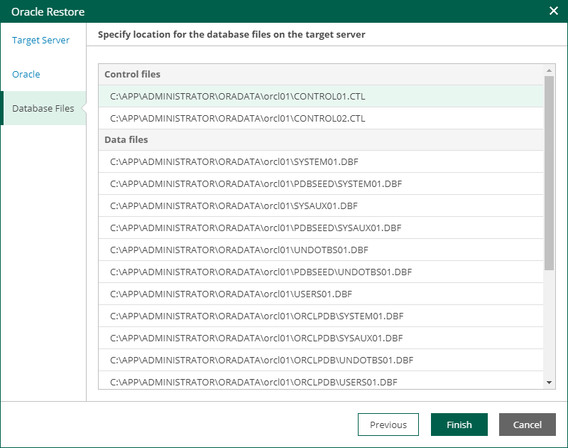

# Step 4. Specify Database Files Location

At the Database Files step of the wizard, specify paths to database files on the target server. Then, click Finish to start the restore operation.

To view the status of the restore process, on the Items tab, click History.

