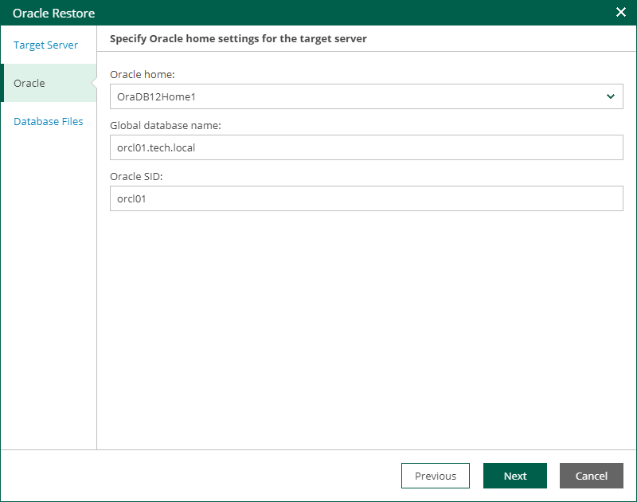

# Step 3. Specify Oracle Home Settings

At the Oracle step of the wizard, specify Oracle home settings.

1. In the Oracle home field, specify Oracle home.
2. In the Global database name field, specify a full name of the database including its network domain.
3. In the Oracle SID field, specify the database system identifier.

If a database with the specified SID exists on the target Oracle home, the restore process will delete it and replace with the database from backup. Thus, before starting the restore process, a message will be displayed, asking you to confirm the operation.

