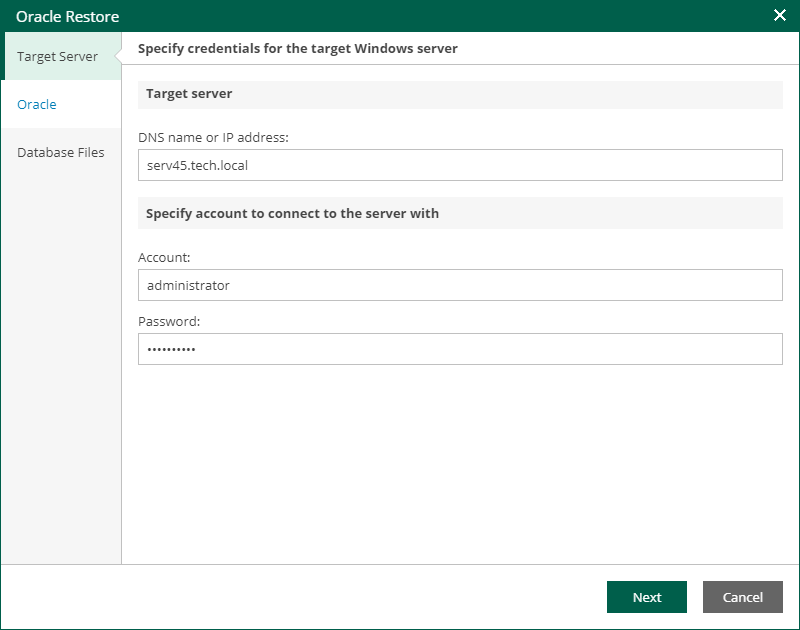
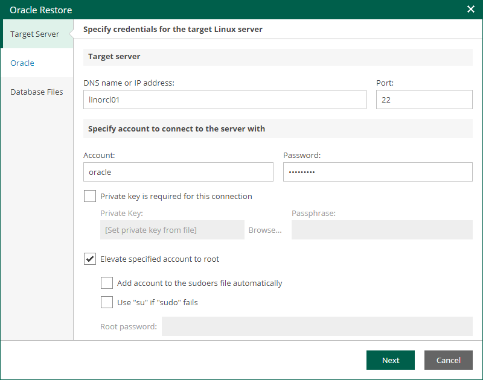

In this article

At the Target Server step of the wizard, specify connection settings required to access the target Oracle server. The set of connection settings depends on the OS type of the target server: Windows or Linux.

Windows-Based Oracle Server

For database restore to a Microsoft Windows server, specify the following connection settings:

1. In the DNS name or IP address field, enter a DNS name or IP address of the target Microsoft Windows server.
2. In the Account and Password fields, specify credentials of the account that will be used for connection with the target Windows-based Oracle server.

Consider the following:

* The user account must be a member of the local Administrator group and have sysdba privileges.
* The user account must be granted appropriate permissions to access Oracle databases; Read and Write are minimum required, Full Control is recommended.
* To copy archived logs to the specified server, the user account must be granted sufficient permissions to access the administrative share.

Linux-Based Oracle Server

For database restore to a Linux server, specify the following connection settings:

1. In the DNS name or IP address field, enter a DNS name or IP address of the target Linux server.
2. In the SSH port field, specify a port number of the target Oracle server (by default, port 22 is used).
3. In the Account filed, specify an account under which to connect to the specified server.
4. In the Password field, enter the password.
5. If a private key is required to connect to the selected server, do the following:

1. Select the Private key is required for this connection check box.
2. In the Private key filed, specify a key.

To select a key, click Browse and select a key.

1. In the Passphrase field, enter the passphrase.

1. If you have specified a non-root account that does not have root permissions on the target server, do the following.

1. To provide a non-root user with root account privileges, select the Elevate specified account to root check box.
2. To add the user account to the sudoers file, select the Add account to the sudoers file automatically check box. In the Root password field, enter the password for the root account.

If you do not enable this option, you will have to manually add the user account to the sudoers file.

1. If the sudo command is not available or may fail on the target Linux server, you have an option to use the su command instead. To enable the su command, select the Use "su" if "sudo" fails check box and in the Root password field, enter the password for the root account.

Veeam Backup & Replication will first try to use the sudo command. If the attempt fails, the su command will be used.

Consider that the user account must be a member of the dba group.

Page updated 11/10/2025

Page content applies to build 13.0.1.1071
