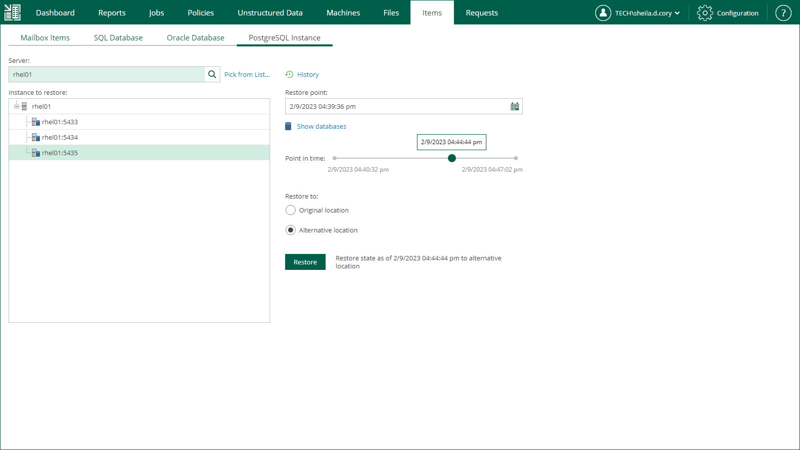

In this article

To launch the PostgreSQL Restore wizard, do the following:

1. Open the Items tab and click PostgreSQL Instance.
2. In the Server field, enter a VM name where the necessary PostgreSQL instance resides.

Alternatively, click the Pick from List link to select from the list of available PostgreSQL machine backups.

1. From the Instance to restore list, select a PostgreSQL instance you need.
2. To specify a restore point from which to restore the instance, in the Restore point field, click the calendar icon and select the necessary date when backup was performed and a restore point created on that date. By default, the latest valid restore point is selected.
3. To view a list of databases included in the restore point, click Show databases.
4. For PostgreSQL instances with transaction log backup turned on, you can also select the necessary point in time using the Point in time slider. The slider displays the following timestamps (relative to the currently selected restore point):

* The beginning point refers to the previous restore point of the PostgreSQL machine that contains the selected database backup. If the previous restore point (server backup) is not found, or the database backup does not exist in it, then the beginning point refers to the current restore point.

* The ending point refers to the next restore point that contains the selected database backup. If the next restore point (server backup) and the associated transaction log backup are not found, or if the database backup does not exist in the server backup, then the ending point will refer to the current restore point. If the next restore point (server backup) is not found, but the transaction log backup exists for the preceding period, then the ending point refers to the latest log backup time.

For more information on configuring transaction log backup, see [PostgreSQL Archive Log Settings](jobs_aap_postgresql.md).

1. In the Restore to section, select the Alternative location option.
2. Click Restore.

Page updated 9/2/2025

Page content applies to build 13.0.1.1071
