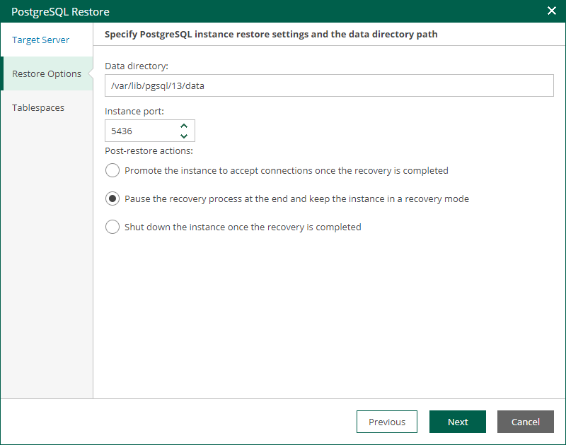

In this article

At the Restore Settings step of the wizard, specify instance folder and instance port.

1. In the Data directory field, specify a path to the directory where the restored instance data will be stored.
2. In the Instance port field, specify a TCP port that will be used to connect to the instance.
3. Select one of the following post-restore actions that the PostgreSQL server must take after the instance is restored. For more information, see the [Specify Post-Restore Action](https://helpcenter.veeam.com/docs/vbr/userguide/vep_restore_single_tas_specify_post_restore_action.html?ver=13) section of the Veeam Explorers User Guide.

* Select Promote the instance to accept connections once the recovery is completed to make the PostgreSQL instance available for connections.
* Select Pause the recovery process and keep the instance in a recovery mode to make the PostgreSQL instance run but not accepting incoming remote TCP connections.
* Select Shut down the instance once recovery is completed to make the PostgreSQL instance stop upon recovery.

Page updated 11/10/2025

Page content applies to build 13.0.1.1071
