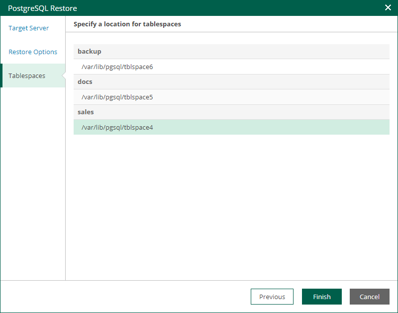

In this article

At the Tablespaces step of the wizard, enter paths of directories where database tables will be stored. Then, click Finish to start the restore operation.

To view the status of the restore process, on the Items tab, click History.

Page updated 11/10/2025

Page content applies to build 13.0.1.1071
