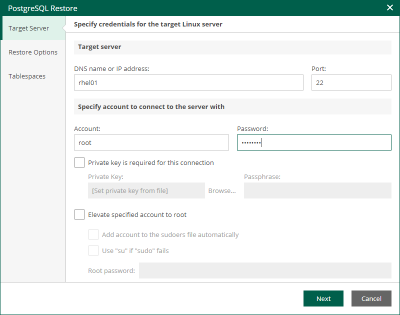

In this article

At the Target Server step of the wizard, specify settings for connection to the target PostgreSQL server.

1. In the Target Server section, enter a DNS name or IP address of the target server, as well as an SSH port (by default, port 22 is used).
2. Specify credentials of the account that will be used to connect to the target server:

1. In the Account field, specify the account name.
2. In the Password field, specify the account password.
3. If you want to use a Linux private key for this connection, select the Private key is required for this connection check box and specify the following private key settings:

1. In the Private key field, specify a file that contains a private key.
2. In the Passphrase field, enter the passphrase used to decrypt the private key.

1. If you have specified a non-root account that does not have root permissions on the target server, select the Elevate specified account to root check box.

The account must have root privileges to mount the backed up file system to mount the backed up file system to the target server and to communicate with PostgreSQL.

1. To add the user account to the sudoers file, select the Add account to the sudoers file automatically check box. In the Root password field, enter the password for the root account.

If you do not enable this option, you will have to manually add the user account to the sudoers file.

1. If you plan to use the account to connect to Linux servers where the sudo command is not available or may fail, you have an option to use the su command instead. To enable the su command, select the Use "su" if "sudo" fails check box and in the Root password field, enter the password for the root account.

Veeam Backup & Replication will first try to use the sudo command. If the attempt fails, Veeam Backup & Replication will use the su command.

Page updated 11/10/2025

Page content applies to build 13.0.1.1071
