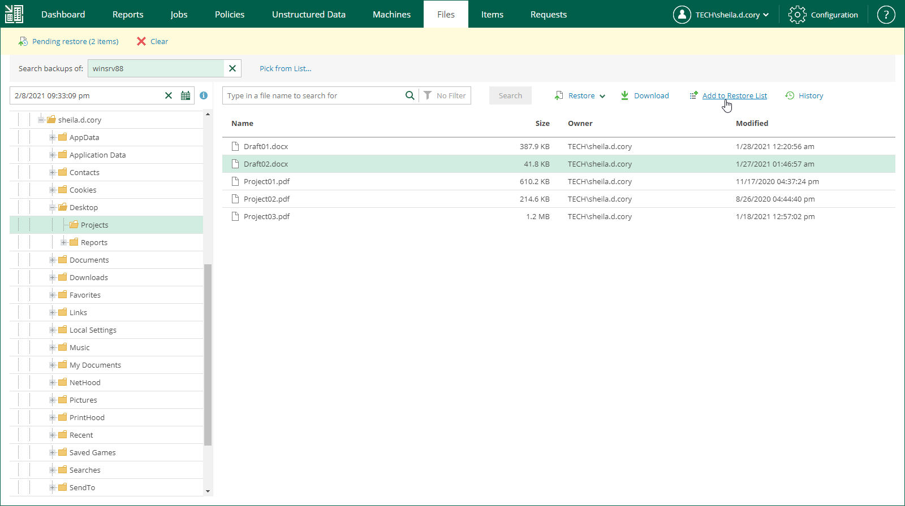
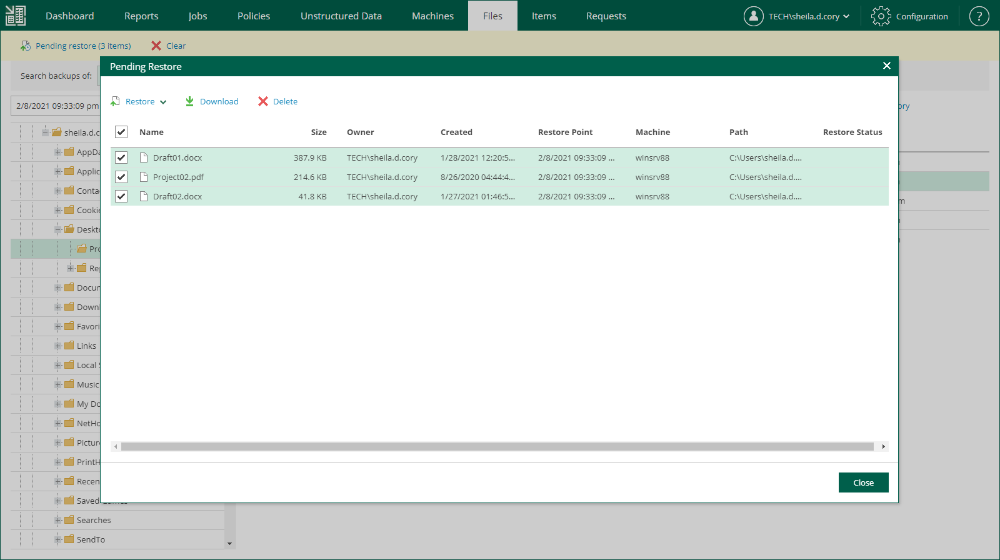

# Using Restore Lists

If you want to restore multiple file system objects (files or folders), you can add the necessary files to the restore list and then restore all files at once. Using the restore list helps you prepare for file restore from different machines and restore points.

Adding Objects to Restore Lists

To add objects to the restore list, do the following:

1. Find the objects you want to restore. You can select one or multiple objects. For details, see [Browsing Machine Backups for Guest OS Files](browsing_vm_backups.md) and [Searching for Guest OS Files in Machine Backups](searching_vm_backups.md).
2. Click Add to Restore List.

When a file is added to the restore list, the Pending restore notification appears at the top of the Enterprise Manager window.

Restoring Objects from Restore Lists

After you add all objects to the restore list, you restore them. To restore the objects, do the following:

1. In the restore list notification, click Pending restore.
2. In the Pending Restore window, select check boxes next to files in the restore list that you want to restore. Use the check box next to the header of the Name column to select all files in the list at once.

If you want to remove a file from the restore list, select the file and click Delete.

1. Click the Restore or Download link to perform the necessary restore operation for the selected files.
2. In the displayed window, click Yes.
3. [For the download operation] Wait for restore session to complete. On the Log tab of the File Restore History view, click the download link.

The objects are saved to the default download folder on your local machine.

Multiple files are also saved in a ZIP file named FLR\_<date>\_<time>.zip in the %ProgramData%\Veeam\Backup\WebRestore folder. Veeam Backup Enterprise Manager cleans up the folder periodically. Files older than 24 hours are automatically deleted. To change the default storage folder, contact [Veeam Customer Support](https://www.veeam.com/support.html).

|  |
| --- |
| Tip |
| Veeam Backup Enterprise Manager keeps links for downloaded files in the history for one day. To download a file that was previously restored:   1. On the Files tab, click History. 2. In the File Restore History view, select the necessary restore session. 3. On the Log tab, click the download link. |

